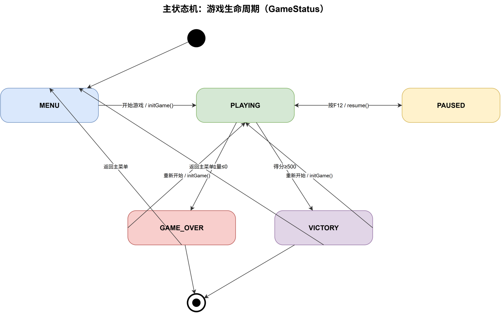
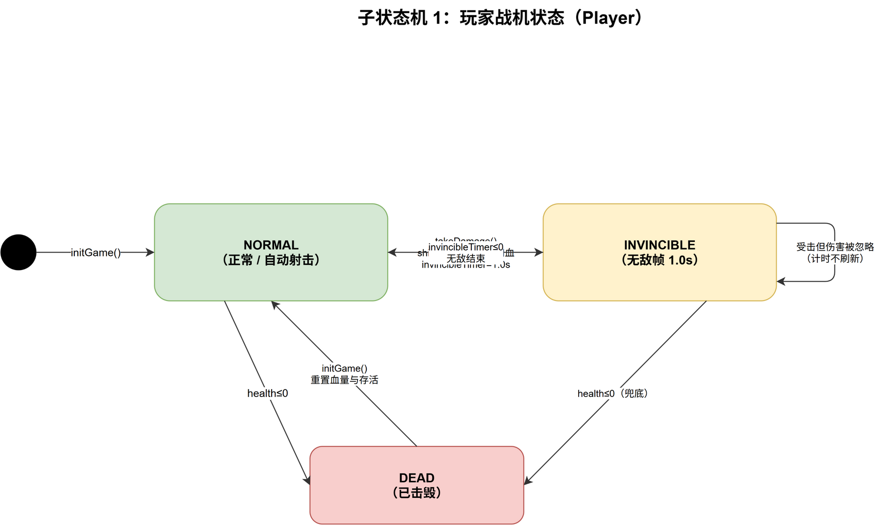
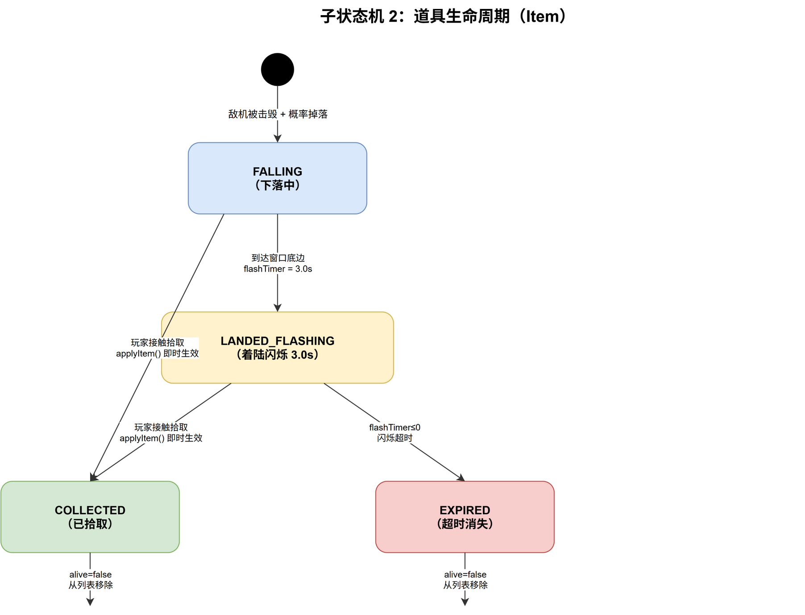

# 详细设计说明书 v1.0

- **组名**：飞机大战项目组（廖尉钧、孙浩凡、孙嘉晟、艾奕舟、霍睿深）
- **日期**：2026-09-10
- **版本基线 tag**：`v1.0-design`（对应 Git 提交：`feature/detailed-design` → `--no-ff` 合并入 `master`）
- **代码基线**：`C:\Users\huoru\IdeaProjects\2609\plane`，master 分支 HEAD = `5d2575d`（添加了子弹，飞机，boss图片）
- **前置文档**：《需求规格说明书》v1.0（tag `v0.1-requirements`）、《概要设计说明书》v1.0（tag `v0.2-design`）
- **技术环境**：JDK 17 + JavaFX 17.0.8 + Maven 3.x + JUnit 5.10.2
- **评审状态**：待评审

> **三处版本一致**：本文档标题 `v1.0` / 合并提交信息 `docs: 详细设计说明书 v1.0` / Git tag `v1.0-design`。

---

## 1. 概述

### 1.1 与 HLD 的对应关系

本设计以《概要设计说明书》v1.0 第 4 章「类设计」与第 5 章「接口设计」为输入，逐条落地。**已按 HLD 落地**与**发生调整**的项如下（调整均说明理由，并标注后续处置）。

#### 1.1.1 按 HLD 原样落地

| HLD 设计元素 | 落地实体（真实文件） | 一致性核对 |
| --- | --- | --- |
| `view` / `controller` / `model` 三层包结构 | `cn.edu.csu.plane.view` / `.controller` / `.model` | ✅ 一致；另有 `.util.GameConfig` 常量类 |
| `model` 层零 JavaFX 依赖 | `model` 与 `util` 包下 16 个类均无 `javafx.*` import | ✅ 一致（编译期即验证） |
| `GameModel` 作为 Model 对外契约接口 | `model/GameModel.java`（接口先行） | ✅ 一致 |
| `GameView` 渲染画面并接收键盘事件 | `view/GameView.java#render` | ⚠️ 部分调整，见 1.1.2 |
| `GameController` 转发事件、调度帧更新 | `controller/GameController.java` | ⚠️ 骨架未实现，见 1.1.2 |
| `Enemy` 预留 `type` 字段区分机型 | `model/EnemyType.java`（`NORMAL/MOVING/SHOOTING/BOMBER/BOSS`） | ✅ 一致 |
| 图码一致（类图 / 时序图 / 数据流图） | `docs/drawio/*.drawio` 与源码逐类比对 | ✅ 一致 |

#### 1.1.2 相对 HLD 的调整及理由

| # | HLD 原设计 | 详细设计调整 | 理由 | 处置 |
| --- | --- | --- | --- | --- |
| A1 | `PlaneGameModel` 单类承载全部逻辑，类图已列出 `CollisionManager` / `SpawnManager` 作为 controller 成员 | 碰撞与生成**在 v1.0 内聚为 `GameModelImpl` 的私有方法**（`checkCollisions`、`updateSpawn`、`spawnEnemy`）；`controller/CollisionManager`、`controller/SpawnManager` 保留空骨架 | 三类结算共用一组实体列表，若跨层调用需反复传 4 个集合参数；且规则判定属业务逻辑，按 HLD 第 3 章「controller 不得实现业务判断」应留在 model | **采纳（最终态）**：`controller.SpawnManager` / `controller.CollisionManager` 将在 v1.1 评审后决定删除或降级为纯委托类 |
| A2 | `PlayerPlane` 类名 | 更名为 `Player` | 与 `Entity` 命名风格统一，且「Plane」在敌方（`NormalEnemy` 等）上不出现，避免名字暗示阵营 | **采纳** |
| A3 | 无统一实体基类 | 新增抽象类 `Entity`（坐标/尺寸/速度/存活 + `update` + `isOutsideScreen`） | 四类实体共有 7 个字段，统一后可让 `updateEntities(List<? extends Entity>)` 一个方法处理三类列表 | **采纳** |
| A4 | `Enemy` 单类 + 行为分支 | 抽象基类 `Enemy` + 4 个子类（`NormalEnemy`/`MovingEnemy`/`ShootingEnemy`/`BomberEnemy`），移动轨迹抽为 `protected abstract void movePattern(double)` | 消除 `switch(type)` 散落在 update 中的分支；新增机型只需加子类 | **采纳** |
| A5 | `Prop` 道具类 | 更名为 `Item`，配 `ItemType` 枚举（4 值） | 「Prop」在 Spring/前端语境另有含义；`Item` 与列表字段 `items` 命名一致 | **采纳** |
| A6 | `GameModel.start()` / `tick()` / `getLives()` / `getGameSnapshot()` | 改名为 `initGame()` / `update(double deltaTime)` / `getHealth()` / 由 `getEnemies()`+`getBullets()`+`getItems()`+`getPlayer()` 取代快照 | ①`initGame` 与 `restart` 语义区分更明确；②`update` 必须带 `deltaTime`，否则帧率变化会改变游戏速度（见 4.2）；③`int[][]` 快照是 Tetris 式网格残留，本项目实体是浮点坐标，快照会丢精度 | **采纳** |
| A7 | 状态由 model 内部隐式持有 | 抽出独立类 `GameState`（状态 + 分数 + 关卡 + 计时） | 状态迁移与数值规则可单独测试，不与实体列表耦合 | **采纳** |
| A8 | 时间基准未定义 | `update(double deltaTime)` 显式以**秒**为单位；速度字段单位统一为**像素/秒** | 满足 NF-01 帧率无关性 | **采纳** |
| A9 | HLD 第 3 章要求「controller 不得实现业务判断」 | 当前 `GameController.update()` 为空，逻辑全在 model | 与 A1 同源 | **待评审**（见 5.7） |
| A10 | HLD 状态机含 `MENU → PLAYING` 的初始迁移 | HLD 第 5 章接口表**未定义玩家在菜单点击「开始」的入口方法**，SRS 亦未把 MENU 列入状态 | 需求侧遗漏 | **待确认**：建议 SRS v1.1 补 MENU 态条目（见 3.4） |

### 1.2 术语（本项目特有名词）

| 术语 | 在本设计中的严格含义 | 代码锚点 |
| --- | --- | --- |
| 战场 | 900×700 的逻辑矩形区域，坐标为浮点像素、原点在左上、y 轴向下 | `GameConfig.WINDOW_WIDTH/HEIGHT` |
| 帧推进一步 | 一次 `GameModelImpl.update(deltaTime)` 调用，内部含 8 个有序阶段 | `GameModelImpl#update` |
| 步长 `deltaTime` | 上一帧到本帧的秒数，全部运动量 = 速度 × `deltaTime` | `Entity#move(double)` |
| 存活位 `alive` | 实体的逻辑存活标记；**置 false 不立即从列表删除**，统一在帧末 `removeDeadEntities()` 清理 | `Entity#alive`、`GameModelImpl#removeDeadEntities` |
| 延迟清理 | 「本帧标记死亡 → 帧末统一移除」的两段式结算，保证遍历中不破坏迭代器 | 同上 |
| 无敌帧 | 玩家受击后的 1.0 秒免伤窗口，**计时不因重复受击而刷新** | `Player#takeDamage`、`Player#update` |
| 护盾 | 一次性伤害抵消标记，优先于无敌帧与血量结算被消耗 | `Player#shielded` |
| 击毁 | 敌机 `health ≤ 0` 被置 `alive = false` 的过程 | `Enemy#takeDamage` |
| 掉落 | 击毁敌机时按 20% 概率生成一件随机道具 | `GameModelImpl#dropItem` |
| 着陆闪烁 | 道具触底后停住并倒计时 3.0 秒，超时自毁 | `Item#update` |
| 交子弹 | 开火方（`Player`/`ShootingEnemy`）返回子弹列表，由 `GameModelImpl` 统一收进 `bullets` | `Player#shoot`、`ShootingEnemy#shoot` |
| 一级偏差 | 源码实现值与 SRS v1.0 文本值**不一致**的参数，本设计统一登记在 7.3 与附录 B | 见 7.3 |

---

## 2. 类与方法设计

> 说明：每张表列出该类**全部**公开/受保护方法及关键私有方法。前置条件为「调用方必须先满足的状态」，后置条件为「返回后必然成立的事实」。设计落点标注该方法在 SRS 需求编号与 HLD 图元上的归属。

### 2.1 `cn.edu.csu.plane.util.GameConfig`

| 方法名 | 签名 | 前置条件 | 后置条件 | 设计落点与理由 |
| --- | --- | --- | --- | --- |
| 常量访问（无需实例） | `public static final int WINDOW_WIDTH = 900` | 无 | 全工程窗口宽度唯一来源 | NF-04 可配置性的最小形态；`private GameConfig()` 禁止实例化，避免出现「有状态的配置对象」 |

### 2.2 抽象基类 `model.Entity`

| 方法名 | 签名 | 前置条件 | 后置条件 | 设计落点与理由 |
| --- | --- | --- | --- | --- |
| `Entity` | `protected Entity(double x, double y, double width, double height)` | `width > 0 && height > 0`（构造方保证） | `alive == true`，`velX == velY == 0` | 四类实体的统一构造入口；HLD 新增抽象层（A3） |
| `update` | `public abstract void update(double deltaTime)` | `deltaTime >= 0` | 子类完成本帧位移与状态推进 | 模板方法：`Enemy` 再抽一层到 `movePattern`；对应时序图 2「帧推进」 |
| `move` | `protected void move(double deltaTime)` | 已设置 `velX/velY` | `x += velX*dt`，`y += velY*dt` | **唯一**允许直接改坐标的位移入口，保证帧率无关（F02/F05） |
| `isOutsideScreen` | `protected boolean isOutsideScreen()` | 无 | 当 `y + height < 0` 或 `y > WINDOW_HEIGHT` 时为真 | F05 离场销毁判定的公共实现；上下双向越界用同一判据 |
| 访问器 | `getX/getY/getWidth/getHeight/getVelX/getVelY()` | 无 | 返回当前值（基本类型拷贝） | 供 model 内部判定与 view 渲染共用的只读出口 |
| 存活位 | `isAlive()` / `setAlive(boolean)` | 无 | 置 false 仅标记，不移除 | 支撑「延迟清理」协议 |

### 2.3 `model.Player`

| 方法名 | 签名 | 前置条件 | 后置条件 | 设计落点与理由 |
| --- | --- | --- | --- | --- |
| `Player` | `public Player(double x, double y, double width, double height)` | 尺寸与 `Bullet` 不冲突（宽度 > 16） | `health == maxHealth == GameConfig.DEFAULT_HEALTH`，`firePower == 1`，`fireRate == 0.5`，`fireCooldown == 0`，`invincibleTimer == 0`，`shielded == false` | F07 初始血量；出生点在战场底部中央由 `GameModelImpl` 传参决定 |
| `update` | `public void update(double deltaTime)` | `deltaTime >= 0` | `invincibleTimer` 与 `fireCooldown` 各自减去 `deltaTime`（下限不截断，靠 `<= 0` 判定） | F07 无敌倒计时唯一推进点；与 `Entity.move` 解耦，因为玩家位置由输入驱动而非速度驱动 |
| `move` | `public void move(double deltaX, double deltaY)` | 无 | 坐标增加位移量后**四边夹紧**在 `[0, W-w] × [0, H-h]` 内 | F02 边界限制；直接在 model 内夹紧而非返回失败，保证 view 无需知道边界规则 |
| `isReadyToShoot` | `public boolean isReadyToShoot()` | 无 | `fireCooldown <= 0` 时为真 | F03 自动射击的判定出口；让 `GameModelImpl` 不必看到冷却细节 |
| `shoot` | `public List<Bullet> shoot()` | **调用方需先确认 `isReadyToShoot()`**（本方法不检查） | `fireCooldown = fireRate`；返回 1 发（`firePower <= 1`）或左右各 1 发（`firePower >= 2`）的**新列表** | F03；子弹从机头（`x + width/2 - Bullet.WIDTH/2`）生成、速度 `-600` 向上。返回新列表而非直接写 `bullets`，贯彻「交子弹」协议，使 Player 不认识战场 |
| `takeDamage` | `public void takeDamage(int damage)` | `damage > 0` | 三分支之一：①有盾 → 消耗盾、血量不变、**不进入无敌**；②`invincibleTimer > 0` → 完全忽略；③否则扣血、置 `invincibleTimer = 1.0`，`health <= 0` 时夹到 0 并置 `alive = false` | F07 核心规则；护盾优先于无敌（护盾是主动资源，不应被无敌帧吞掉） |
| `heal` | `public void heal(int amount)` | `amount > 0` | `health = min(health + amount, maxHealth)` | F10 回血道具；上限夹紧防溢出 |
| `enhanceFirePower` | `public void enhanceFirePower()` | 无 | `firePower++`（**无上限，见 6.2 问题 P3**） | F10 火力强化 |
| `activateShield` | `public void activateShield()` | 无 | `shielded = true`（重复拾取不叠加层数） | F10 护盾 |
| 访问器 | `getHealth/getMaxHealth/getFirePower/getFireRate/isInvincible/isShielded` | 无 | 返回当前值 | HUD 渲染与测试断言出口 |

### 2.4 抽象基类 `model.Enemy` 与 4 个子类

| 方法名 | 签名 | 前置条件 | 后置条件 | 设计落点与理由 |
| --- | --- | --- | --- | --- |
| `Enemy` | `protected Enemy(double x, double y, double width, double height, EnemyType type, int health, int score)` | `health > 0 && score >= 0` | `maxHealth == health`，记录 `type`，`alive == true` | F05/F08；`type` 字段为 HLD 明确预留 |
| `update` | `public void update(double deltaTime)` | `deltaTime >= 0` | 转调 `movePattern(deltaTime)` | 统一入口，避免子类各写一套 update 签名 |
| `movePattern` | `protected abstract void movePattern(double deltaTime)` | 子类实现 | 完成本帧移动 + 越界自毁 | 把「怎么动」留给子类、「何时死」由子类在越界时置 `alive=false` |
| `takeDamage` | `public void takeDamage(int damage)` | `damage > 0` | `health -= damage`；`health <= 0` 时夹 0 并置 `alive = false`；**不在此加分数** | F06；计分交由 `GameModelImpl` 统一执行，避免「谁死谁加分」造成重复计分 |

| 子类 | 关键参数（源码实测） | `movePattern` 行为与边界 |
| --- | --- | --- |
| `NormalEnemy` | 40×40，HP 2，分值 50，`velY = 150` | 直线下移；`isOutsideScreen()` 即自毁，不给分（F05） |
| `MovingEnemy` | 50×50，HP 1，分值 150，`velY = 110`，摆速 130 | 横向摆动 + 下移；碰左右边界夹紧并 `direction` 取反；越界自毁 |
| `ShootingEnemy` | 50×50，HP 3，分值 300，`velY = 90`，射击间隔 2.0s，弹速 260，弹伤 10 | 下移 + 冷却递减；`shoot()` 冷却未到返回 `Collections.emptyList()`，到点返回 1 发弹并重置冷却；出屏自毁并 `return`（避免死后开火） |
| `BomberEnemy` | 50×50，HP 1，分值 500，`velY = 430` | 高速俯冲下移，越界自毁；**源码未实现「碰撞玩家高额伤害」（见 6.2 问题 P4）** |

### 2.5 `model.Bullet`

| 方法名 | 签名 | 前置条件 | 后置条件 | 设计落点与理由 |
| --- | --- | --- | --- | --- |
| `Bullet` | `public Bullet(double x, double y, double velY, int damage, boolean playerBullet)` | `damage > 0` | 尺寸固定为 `WIDTH=6 × HEIGHT=14`；`playerBullet` 区分阵营 | 6×14 是**修复过的坑**：早期传 0 导致碰撞盒面积为 0、永远判定不中，故提为常量并在此固定 |
| `update` | `public void update(double deltaTime)` | `deltaTime >= 0` | 按 `velY` 位移；出屏（上或下）置 `alive=false` | F03 子弹出屏销毁；同一判据服务玩家弹与敌弹 |
| `getDamage` / `isPlayerBullet` | `public int getDamage()` / `public boolean isPlayerBullet()` | 无 | 返回不可变属性 | 碰撞结算据此决定扣谁的血 |

### 2.6 `model.Item`

| 方法名 | 签名 | 前置条件 | 后置条件 | 设计落点与理由 |
| --- | --- | --- | --- | --- |
| `Item` | `public Item(double x, double y, ItemType type)` | `type != null` | 尺寸 30×30，`velY = 110`，`flashTimer = 0`，`landed = false` | F10 掉落物 |
| `update` | `public void update(double deltaTime)` | `deltaTime >= 0` | **两态语义**：未着陆 → 下移，触底则夹到 `H - height`、`landed = true`、`flashTimer = 3.0`；已着陆 → `flashTimer -= deltaTime`，`<= 0` 置 `alive = false` | F10 闪烁 3 秒消失；用 `landed` 布尔而非枚举实现子状态机（见 3.3 与 5.6） |
| `getType` / `getFlashTimer` | `public ItemType getType()` / `public double getFlashTimer()` | 无 | 返回当前值 | 前者供 `applyItem` 分派，后者供 view 做闪烁节奏与测试断言 |

### 2.7 `model.GameState`

| 方法名 | 签名 | 前置条件 | 后置条件 | 设计落点与理由 |
| --- | --- | --- | --- | --- |
| `GameState` | `public GameState()` | 无 | `status = MENU`，`score = 0`，`level = 1`，`elapsedTime = 0` | 开局状态为 MENU（SRS 未定义，见 A10） |
| `resetScore` | `public void resetScore()` | 无 | `score = 0`，`level = 1` | F01 开始游戏重置；`elapsedTime` 当前未重置（见 6.2 问题 P7） |
| `addScore` | `public void addScore(int score)` | `score > 0` | `this.score += score`；若 `score >= level * 200` 则 `level++` | F08/F11；**关卡阈值 200/级，与 SRS 的 1000 分/关冲突**；`if` 应为 `while`（见 6.2 问题 P1） |
| 状态读写 | `getStatus()` / `setStatus(GameStatus)` | `setStatus` 参数非 null | 新状态立即生效 | 状态机唯一写入口；不校验迁移合法性（由调用方守卫，见 3.1） |
| 数值读取 | `getScore()` / `getLevel()` / `getElapsedTime()` | 无 | 返回当前值 | HUD 数据源 |

### 2.8 `model.GameModel`（接口）

| 方法名 | 签名 | 前置条件 | 后置条件 | 设计落点与理由 |
| --- | --- | --- | --- | --- |
| `initGame` | `void initGame()` | 任意状态可调 | 分数归零、血量回满、玩家复活、三个实体列表清空、`spawnTimer` 归零、状态置 PLAYING | F01；HLD `start()` 的更名版本（A6） |
| `update` | `void update(double deltaTime)` | `deltaTime >= 0` | 状态为 PLAYING 时推进一帧；非 PLAYING 时**整帧冻结且不计分** | F02 主循环契约；冻结守卫放在实现首行，是所有「暂停/结束不响应」承诺的单点保障（F12/F14） |
| `pause` | `void pause()` | 状态为 PLAYING 才生效 | 状态置 PAUSED | F12；幂等（重复调用无副作用） |
| `resume` | `void resume()` | 状态为 PAUSED 才生效 | 状态置 PLAYING | F12；幂等 |
| `movePlayer` | `void movePlayer(double dx, double dy)` | 状态为 PLAYING（当前实现未校验，见 6.2 问题 P6） | 玩家位移并夹紧边界 | F02 |
| `getPlayer` | `Player getPlayer()` | 无 | 返回**内部引用** | 视图渲染出口；引用泄露风险见 5.1 |
| `getEnemies` / `getBullets` / `getItems` | `List<Enemy> getEnemies()` 等 | 无 | 返回**内部可变列表引用** | 同上；HLD 原设计为 `getGameSnapshot()`，已按 A6 调整 |
| `getScore` / `getHealth` / `getLevel` / `getStatus` | 对应基本类型 | 无 | 返回当前值 | HUD 与状态机查询 |
| `addScore` | `void addScore(int amount)` | `amount > 0` | 转发 `GameState.addScore`，可能触发升级 | F08；供炸弹清屏按敌机分值补分 |

### 2.9 `model.GameModelImpl`（核心实现）

| 方法名 | 签名 | 前置条件 | 后置条件 | 设计落点与理由 |
| --- | --- | --- | --- | --- |
| `initGame` | `public void initGame()` | 无 | 见 2.8；**未重置玩家坐标、未重置 `gameState.elapsedTime`** | F01；坐标未复位为已登记缺陷（P7） |
| `update` | `public void update(double deltaTime)` | 无 | 按 8 阶段顺序推进（详见 4.2）：冻结守卫 → 玩家计时 → `autoShoot` → `updateSpawn` → 敌机/敌弹/子弹/道具移动 → `checkCollisions` → `removeDeadEntities` → 结束判定 | **本类的骨架方法**。阶段顺序即设计决策：先移动后碰撞、先结算后清理、最后判胜负，保证一帧内一致性 |
| `pause` / `resume` | `public void pause()` / `public void resume()` | 见 2.8 | 状态迁移 | F12；仅做状态守卫，不停表（时间由 view 层停止投喂 `deltaTime` 实现） |
| `autoShoot` | `private void autoShoot()` | 无 | `player.isReadyToShoot()` 为真时把 `player.shoot()` 的结果并入 `bullets` | F03；把「玩家不手动开火」这一产品决策收成一个方法，便于日后改为手动时只改此处 |
| `updateSpawn` | `private void updateSpawn(double deltaTime)` | 无 | `spawnTimer += deltaTime`；达到 `currentSpawnInterval()` 时归零并生成 1 架敌机 | F04 生成节奏 |
| `currentSpawnInterval` | `private double currentSpawnInterval()` | 无 | `max(2.0 - (level-1)*0.15, 0.6)` | F11 难度递增；下限 0.6s 防止高关卡瞬间刷满屏 |
| `spawnEnemy` | `private Enemy spawnEnemy()` | 无 | 随机机型、随机横坐标 `x ∈ [0, W-size)`、`y = -size`（顶部界外） | F04；用 Java 17 `switch` 表达式按类型构造，缺省分支兜底为普通机 |
| `randomType` | `private EnemyType randomType()` | 无 | 按关卡权重掷机型：`advanced = min(level-1, 4)`，普通权重恒为 3，三种高级机型各占 `advanced` | F11；第 1 关纯普通机（`advanced = 0`），之后高级机占比单调上升且有上限 |
| `collectEnemyBullets` | `private void collectEnemyBullets()` | 无 | 遍历敌机，把 `ShootingEnemy` 开出的弹并入 `bullets` | 「交子弹」协议的收口；`instanceof` 模式匹配（Java 17） |
| `updateEntities` | `private void updateEntities(List<? extends Entity> entities, double deltaTime)` | 列表非 null | 逐个调用 `entity.update(deltaTime)` | 泛型通配符让三类列表共用 1 个方法，消除 3 段重复循环 |
| `removeDeadEntities` | `private void removeDeadEntities()` | 无 | 三个列表各执行一次 `removeIf(!isAlive)` | 延迟清理协议的第二段；用 `removeIf` 而非遍历中删除，避免 `ConcurrentModificationException` |
| `checkCollisions` | `private void checkCollisions()` | 无 | 依次调用 4 个判定方法 | F06；拆分顺序即优先级：弹打机 → 弹打人 → 机撞人 → 人捡道具 |
| `checkBulletEnemy` | `private void checkBulletEnemy()` | 无 | 玩家弹命中敌机 → 弹销毁、敌机扣血；敌机死亡 → `addScore(enemy.getScore())` 并 `dropItem` | F06/F08/F10；**命中即 `break`，一发弹只结算一架敌机**（设计取舍见 5.5） |
| `checkBulletPlayer` | `private void checkBulletPlayer()` | 玩家存活 | 敌弹命中玩家 → 弹销毁、`player.takeDamage(bullet.getDamage())` | F07；伤害值由子弹携带（当前恒为 10） |
| `checkPlayerEnemy` | `private void checkPlayerEnemy()` | 玩家存活 | 碰撞敌机即销毁该敌机，玩家受 `COLLISION_DAMAGE = 20` 伤害 | F07；敌机类型不参与伤害计算（自爆机差异未实现，P4） |
| `checkPlayerItem` | `private void checkPlayerItem()` | 玩家存活 | 碰撞道具即标记销毁并 `applyItem(item.getType())` | F10；拾取与生效同帧完成 |
| `dropItem` | `private void dropItem(Enemy enemy)` | 敌机已被击毁 | 以 `ITEM_DROP_RATE = 0.2` 概率在敌机位置生成 1 件随机类型道具 | F10；随机源为单例 `Random`，不做种子固定（便于人工复现则需另行注入） |
| `applyItem` | `private void applyItem(ItemType type)` | `type != null` | `FIREPOWER → enhanceFirePower`、`HEAL → heal(30)`、`SHIELD → activateShield`、`BOMB → clearBattlefield` | F10；**switch 语句无 default 分支**，新增枚举值会静默无效果（见 6.2 问题 P5） |
| `clearBattlefield` | `private void clearBattlefield()` | 无 | 场上全部敌机按其分值计入得分后清空；移除所有敌弹（保留玩家弹） | F10 全屏炸弹；`removeIf(!isPlayerBullet)` 保证玩家自己的弹不被误清 |
| `isColliding` | `private boolean isColliding(Entity a, Entity b)` | a、b 非 null | AABB 相交判定（详见 4.1） | 4 类碰撞共用 1 个判定式，避免 4 份重复的坐标比较 |
| 查询转发 | `getPlayer/getEnemies/getBullets/getItems/getScore/getHealth/getLevel/getStatus` | 无 | 转发到 `player` 或 `gameState` | 见 2.8 |

### 2.10 `view` / `controller` 层骨架（v1.0 未实现，仅登记契约）

| 类 | 方法 | 契约（设计意图） | 当前状态 |
| --- | --- | --- | --- |
| `view.PlaneApp` | `start(Stage)` | 创建 900×700 `Scene`、装配根面板、显示窗口 | ✅ 已实现最小窗口（`StackPane` + 标题 "Plane"） |
| `view.GameView` | `render(Player, List<Enemy>, List<Bullet>, List<Item>)` | 绘制背景与全部实体 | ⚠️ 方法签名已定，`drawBackground` / `drawEntities` 为空 |
| `view.HUDView` | `drawHUD(long score, int health, int firePower)` | 绘制得分/血量/火力 | ⚠️ 空实现 |
| `view.MainMenuView` | `show()` | 标题、开始、说明、排行榜、难度、关于 | ⚠️ 空实现 |
| `view.GameOverView` | `show(long score)` | 结算分、重新开始、返回主菜单 | ⚠️ 空实现 |
| `controller.GameController` | `start()` | 启动 `AnimationTimer` 主循环：`update(dt)` → `render()` | ⚠️ 空实现（**这是「主循环可运转」验收项的关键缺口**） |
| `controller.GameController` | `update(double)` / `render()` / `pause()` / `resume()` / `restart()` / `onGameOver()` | 转发给 model 与 view | ⚠️ 空实现；且 `GameController` 持有 `GameState` 而非 `GameModel`，接口装配需调整（见 6.2 问题 P8） |
| `controller.InputHandler` | `attach(Scene)` / `getMoveX()` / `getMoveY()` / `isShooting()` | 键盘 WASD/方向键与鼠标事件 → 归一化位移向量 | ⚠️ 空实现；`isShooting()` 与「自动射击」决策矛盾（见 5.4） |
| `controller.SpawnManager` | `update(double, int)` / `createEnemy()` / `createItem()` | 按难度控制生成节奏 | ⚠️ 空实现；职责已由 `GameModelImpl` 承担（A1） |
| `controller.CollisionManager` | `resolve(Player, List<Enemy>, List<Bullet>, List<Item>)` | 四类碰撞结算 | ⚠️ 空实现；职责已由 `GameModelImpl` 承担（A1） |

---

## 3. 状态机

### 3.1 状态转移表（主状态机：`GameStatus`）

> 守卫条件一栏为空表示「无附加条件，触发即迁移」；标注 **[源码]** 者已在 `GameModelImpl` / `GameState` 中存在，标注 **[待实现]** 者为本设计新增的补齐项。

| # | 当前状态 | 触发 | 守卫条件 | 动作 | 目标状态 | 实现锚点 |
| --- | --- | --- | --- | --- | --- | --- |
| T1 | （初始） | 构造 `GameState` | — | `status = MENU` | `MENU` | **[源码]** `GameState()` |
| T2 | `MENU` | 玩家点击「开始游戏」 | `MENU` 态且无进行中一局 | `initGame()` | `PLAYING` | **[源码]** `GameModelImpl#initGame` |
| T3 | `PLAYING` | 玩家按暂停键 | `status == PLAYING` | `pause()` | `PAUSED` | **[源码]** `GameModelImpl#pause`（守卫符合本行；但按键键位与 SRS 的 P 键不一致，见 D8） |
| T4 | `PAUSED` | 玩家再按暂停键 | `status == PAUSED` | `resume()` | `PLAYING` | **[源码]** `GameModelImpl#resume` |
| T5 | `PAUSED` | 窗口获得焦点 / 玩家点击继续 | `status == PAUSED` | `resume()` | `PLAYING` | **[待实现]** SRS F12 失焦自动暂停的回路 |
| T6 | `PLAYING` | 帧末结算发现玩家死亡 | `!player.isAlive()`（即 `health == 0`） | `status = GAME_OVER`，后续帧冻结 | `GAME_OVER` | **[源码]** `GameModelImpl#update`（该判定优先于胜利判定） |
| T7 | `PLAYING` | 帧末结算发现得分达标 | `score >= 500` **且** 玩家仍存活 | `status = VICTORY`，后续帧冻结 | `VICTORY` | **[源码]** `GameModelImpl#update`（阈值 500 为缺失常量的硬编码） |
| T8 | `GAME_OVER` | 玩家点击「重新开始」 | 结算界面已展示 | `initGame()` | `PLAYING` | **[待实现]** SRS F01/F09 要求的重开入口 |
| T9 | `VICTORY` | 玩家点击「重新开始」 | 结算界面已展示 | `initGame()` | `PLAYING` | **[待实现]** |
| T10 | `GAME_OVER` | 玩家点击「返回主菜单」 | — | 释放本局实体、`status = MENU` | `MENU` | **[待实现]** HLD 状态机图已有此转移，接口层缺方法 |
| T11 | `VICTORY` | 玩家点击「返回主菜单」 | — | 同上 | `MENU` | **[待实现]** 同上 |
| T12 | `MENU` | 窗口关闭 | — | JVM 退出 | （终态，见 3.1.1） | **[源码]** `PlaneApp` 默认关闭行为 |

#### 3.1.1 死状态与不可达状态自查

| 检查项 | 结论 | 说明 |
| --- | --- | --- |
| 每个状态都有入口？ | ✅ 是 | 5 个状态分别由 T1/T2/T3、T4/T5/T2/T8/T9、T6/T7、T2/T8/T9、T10/T11 进入 |
| 每个状态都有出口？ | ✅ 是 | 除终态外，`MENU`→T2、`PLAYING`→T3/T6/T7、`PAUSED`→T4/T5、`GAME_OVER`→T8/T10、`VICTORY`→T9/T11 |
| 有无死状态（无出口且非终态）？ | ✅ 无 | 唯一无出口的是「窗口关闭 → JVM 退出」，属**合法终态**，不算死状态 |
| 有无不可达状态？ | ✅ 无 | 5 个枚举值均可从 `MENU` 出发经有限步到达 |
| 每条转移都有触发？ | ⚠️ 源码缺 4 条 | T5、T8、T9、T10/T11 已在表中定义触发与守卫，但**尚未实现**（对应 6.2 问题 P8/P9） |
| 每条转移都有守卫？ | ⚠️ 1 条守卫不完整 | T7 仅判分数，未排除「同帧已死亡」；由于 T6 先执行并 `return`，实际风险被顺序化解（见 4.2 与 5.5） |
| 同一事件在多状态下的行为？ | ✅ 明确 | `initGame()` 在 `MENU`/`GAME_OVER`/`VICTORY` 三态均可触发 T2/T8/T9，语义一致（重置后进入 `PLAYING`） |

#### 3.1.2 主状态机图



> 源文件：`docs/drawio/state-machine.drawio`（第 1 页「主状态机：游戏生命周期」）。三张图的导出命令（**`--page-index` 为 1 起算**）：
>
> ```bat
> draw.io.exe --export --format png --scale 2 --page-index 1 --output docs\drawio\state-machine.png        docs\drawio\state-machine.drawio
> draw.io.exe --export --format png --scale 2 --page-index 2 --output docs\drawio\state-machine-player.png docs\drawio\state-machine.drawio
> draw.io.exe --export --format png --scale 2 --page-index 3 --output docs\drawio\state-machine-item.png   docs\drawio\state-machine.drawio
> ```
>
> 导出实测尺寸（`--scale 2`）：主状态机 2045×1277、玩家子状态机 1840×1083、道具子状态机 1804×1379。

### 3.2 主状态机图（文字化，便于与 drawio 逐边核对）

```
        (•) ──构造 GameState / status=MENU──▶ ┌────────┐
                                             │  MENU  │
                                             └───┬────┘
                    开始游戏 [MENU] / initGame() │
                                                 ▼
   ┌───────────────────────────────────────▶ ┌──────────┐
   │                                          │ PLAYING  │◀──────────┐
   │             按暂停键 [PLAYING] / pause() │          │           │
   │                                          └──┬────┬──┘           │
   │                                             │    │              │
   │                                             ▼    │              │
   │                                     ┌──────────┐ │              │
   │                                     │  PAUSED  │ │              │
   │                                     └────┬─────┘ │              │
   │        按暂停键 [PAUSED] / resume()      │       │              │
   │                                          └───────┘              │
   │                                                                 │
   │        !player.isAlive()   ┌────────────┐   score>=500           │
   └────────────────────────────│ GAME_OVER  │   ┌──────────┐         │
       重新开始 / initGame()    └──────┬─────┘   │ VICTORY  │─────────┘
                                      │         └────┬─────┘   重新开始 / initGame()
                        返回主菜单     │              │  返回主菜单
                                      ▼              ▼
                                   ┌────────────────────┐
                                   │       MENU         │
                                   └────────────────────┘
```

**无死状态、无不可达状态**：`MENU` 可入可出；`PLAYING`/`PAUSED` 互通；`GAME_OVER`/`VICTORY` 均可回到 `MENU` 或重开；不存在无出口的非终态。

### 3.3 子状态机 ≥ 1 个

#### 3.3.1 子状态机 1：玩家战机状态（嵌在 `PLAYING` 状态内部）

玩家状态是 `PLAYING` 的**正交子状态**：主状态为 `PLAYING` 时，玩家自身在下列三态间迁移。

| # | 当前（子）状态 | 触发 | 守卫条件 | 动作 | 目标（子）状态 | 实现锚点 |
| --- | --- | --- | --- | --- | --- | --- |
| P1 | （初始） | `initGame()` | — | 血量回满、`alive = true`、清无敌计时 | `NORMAL` | **[源码]** `initGame` |
| P2 | `NORMAL` | `takeDamage(d)` | `shielded == false` 且 `invincibleTimer <= 0` | `health -= d`；`invincibleTimer = 1.0` | `INVINCIBLE` | **[源码]** `Player#takeDamage` |
| P3 | `NORMAL` | `takeDamage(d)` | `shielded == true` | `shielded = false`（**不进入无敌**） | `NORMAL`（自环） | **[源码]** `Player#takeDamage` 第 1 分支 |
| P4 | `INVINCIBLE` | `update(dt)` 累积 | `invincibleTimer <= 0` | 无敌结束 | `NORMAL` | **[源码]** `Player#update` + `isInvincible()` |
| P5 | `INVINCIBLE` | `takeDamage(d)` | `invincibleTimer > 0` | 完全忽略本次伤害，**计时不刷新** | `INVINCIBLE`（自环） | **[源码]** `Player#takeDamage` 第 2 分支 |
| P6 | `NORMAL` | `takeDamage(d)` | 扣血后 `health <= 0` | `health` 夹到 0，`alive = false` | `DEAD` | **[源码]** `Player#takeDamage` |
| P7 | `INVINCIBLE` | `takeDamage(d)` | 扣血后 `health <= 0` | 同上 | `DEAD` | **[源码]** 同一方法的扣血分支（**`INVINCIBLE` 态因守卫 P5 永远扣不到血 → 图中 `INVINCIBLE→DEAD` 是冗余边**，见 6.2 问题 P2） |
| P8 | `DEAD` | `initGame()` | — | 血量回满、`alive = true` | `NORMAL` | **[源码]** `initGame` |



> 源文件：`state-machine.drawio` 第 2 页「子状态机1：玩家战机状态」；导出为 `docs/drawio/state-machine-player.png`。

#### 3.3.2 子状态机 2：道具生命周期（嵌在 `PLAYING` 状态内部）

| # | 当前（子）状态 | 触发 | 守卫条件 | 动作 | 目标（子）状态 | 实现锚点 |
| --- | --- | --- | --- | --- | --- | --- |
| I1 | （初始） | 敌机被击毁 | `random.nextDouble() < 0.2` | 在敌机位置生成随机类型道具 | `FALLING` | **[源码]** `GameModelImpl#dropItem` |
| I2 | `FALLING` | `update(dt)` | 未触底（`y + height < 600`） | 下移 110 px/s | `FALLING`（自环） | **[源码]** `Item#update` |
| I3 | `FALLING` | `update(dt)` | `y + height >= 600` | 坐标夹到 `H - 30`，`landed = true`，`flashTimer = 3.0` | `LANDED_FLASHING` | **[源码]** `Item#update` |
| I4 | `LANDED_FLASHING` | `update(dt)` | `flashTimer` 递减到 `> 0` | 继续闪烁 | `LANDED_FLASHING`（自环） | **[源码]** `Item#update` |
| I5 | `LANDED_FLASHING` | `update(dt)` | `flashTimer <= 0` | `alive = false` | `EXPIRED` | **[源码]** `Item#update` |
| I6 | `LANDED_FLASHING` | 玩家碰撞拾取 | `player.isAlive()` 且 `isColliding(player, item)` | `alive = false`，`applyItem(type)` 即时生效 | `COLLECTED` | **[源码]** `checkPlayerItem` + `applyItem` |
| I7 | `FALLING` | 玩家碰撞拾取 | — | — | —— | **从 `FALLING` 拾取为设计上的不变量禁止**：玩家下沿 `y_p + 50 ≤ 650`，道具触底前上沿 `y_i < 570`，两者纵向永不重叠（几何证明见 4.1 的边界分析），故图中 `FALLING→COLLECTED` 的边**不可达**，为冗余边（见 6.2 问题 P10） |
| I8 | `EXPIRED` / `COLLECTED` | 帧末 `removeDeadEntities()` | `alive == false` | 从 `items` 移除 | （离开本状态机） | **[源码]** `removeDeadEntities` |



> 源文件：`state-machine.drawio` 第 3 页「子状态机2：道具生命周期」；导出为 `docs/drawio/state-machine-item.png`。`EXPIRED` 与 `COLLECTED` 均为**合法终态**（由 I8 离开状态机，非死状态）。

### 3.4 状态机自查待办

| 编号 | 事项 | 处置 |
| --- | --- | --- |
| SM-1 | `MENU` 状态未写入 SRS v1.0 功能清单 | 待确认：建议 SRS v1.1 补「F17 主菜单」或明确归入 F01 |
| SM-2 | 暂停键位：drawio 图标注 F12，SRS F12 条目规定 P 键 | 待确认：以 SRS 的 **P 键**为准，图待改 |
| SM-3 | `INVINCIBLE→DEAD`、`FALLING→COLLECTED` 两条冗余边 | 已在 3.3 标注；建议 v1.1 从 drawio 删除或改画为注释 |
| SM-4 | 状态机图缺「窗口失焦自动暂停」的 T5 边 | 待实现后补图 |

---

## 4. 核心算法说明

### 4.1 算法 1：AABB 矩形碰撞判定

**思路**
四类碰撞（弹打机、弹打人、机撞人、人捡道具）全部归约为「两个轴对齐矩形是否相交」。实现只写一次：

```java
private boolean isColliding(Entity a, Entity b) {
    return a.getX() < b.getX() + b.getWidth() &&
           a.getX() + a.getWidth() > b.getX() &&
           a.getY() < b.getY() + b.getHeight() &&
           a.getY() + a.getHeight() > b.getY();
}
```

四条件全用**严格不等号**，即「边缘刚好贴合」不算碰撞。这一选择让玩家贴边滑行时不会被判为撞击，也让子弹擦着敌机边缘飞过时不误判。

**边界**

| 边界情形 | 处理与结论 |
| --- | --- |
| 边缘恰好贴合（`a.x + a.w == b.x`） | 不算碰撞（严格不等号），避免「贴着敌机左右横移却持续掉血」 |
| 退化尺寸（`width == 0`） | 面积 0，恒不碰撞——**这正是历史上的真实 bug**：`Bullet` 早期传 0 尺寸导致永远打不中，故改为常量 6×14 并写成 `public static final` |
| 单帧位移过大（穿透） | 当前最大单帧位移 = `BomberEnemy` 430 px/s × 帧间隔。60 FPS 时约 7.2 px « 碰撞盒最短边 40 px，满足 NF-03；但帧间隔若退化到 > 90 ms（如窗口拖拽卡顿），自爆机的位移会超过 40 px 而可能穿透。**结论**：需在 `GameController` 主循环里对 `deltaTime` 做上限截断（建议 `min(dt, 1/30)`），列入 6.2 问题 P11 |
| 道具为何不会在「下落中被拾取」 | 玩家纵向活动上限 `y_p ≤ 700 - 50 = 650`，道具未触底时 `y_i + 30 < 700` 即 `y_i < 670`，其与玩家纵向区间 `[y_p, y_p+50]` 的重叠要求 `y_i < 650`；而触底判定只在 `y_i + 30 ≥ 700` 时才发生，故 `landed == false` 期间 `y_i < 670` 仍可能落在 `[600, 650)` 区间——**即理论上下落末期可与玩家重叠**。实现中 `checkPlayerItem` 不检查 `landed`，因此该情形**会被判定为拾取**（表现为「道具贴着底部被捡走」），属可接受且与 SRS「接触即可拾取」一致；drawio 中 `FALLING→COLLECTED` 边因此**实际可达**，本表将其由「不可达」修正为「边界情形，可达但概率低」（与 3.3.2 I7 的结论合并，P10 降级为「图示应补守卫注释」） |
| 多对碰撞遗漏 | 弹打机采用「一发弹只结算一架」的 `break` 策略（见 5.5），不存在遗漏；炸弹清屏独立处理 |

**验证方式**
- 单元测试：`EntityTest#isOutsideScreen*`（3 例）验证边界判定的对称性；`BulletTest` 验证 6×14 尺寸被正确设置（`assertEquals(Bullet.WIDTH, b.getWidth(), 0.001)`）。
- 断点实验：在 `isColliding` 首行下断点，令玩家左缘与战场左缘重合后持续按左键，观察坐标停在 0 且碰撞分支不进入（对应 GWT-02）。
- **缺口**：目前**没有**针对 `isColliding` 本身的单元测试（私有方法，需通过 `GameModelImpl` 间接测）。已登记为 P12。

### 4.2 算法 2：帧推进顺序（`update` 的 8 阶段）

**思路**
一帧内的操作顺序直接决定同帧一致性。实现固定为：

```
① 冻结守卫   status != PLAYING → 整帧 return（不移动、不计分）        [F12/F14]
② 玩家计时   player.update(dt)  无敌帧与射击冷却递减                  [F03/F07]
③ 自动射击   autoShoot()                                              [F03]
④ 生成敌机   updateSpawn(dt)                                          [F04]
⑤ 实体移动   敌机 → 收敌弹 → 子弹 → 道具                              [F05]
⑥ 碰撞结算   checkCollisions()（弹-机 → 弹-人 → 机-人 → 人-道具）      [F06/F07/F10]
⑦ 延迟清理   removeDeadEntities()                                     [内存与列表一致性]
⑧ 结束判定   !player.isAlive() → GAME_OVER，否则 score>=500 → VICTORY [F09]
```

**为什么是这个顺序**

| 顺序决策 | 理由 |
| --- | --- |
| 守卫放最前 | 让「暂停时冻结一切」成为单点保证，而非在 8 个阶段各写一次判断 |
| 先移动后碰撞 | 碰撞必须在实体处于**本帧最终位置**时判定，否则会出现「看起来撞上了但没扣血」 |
| 收敌弹在敌机移动之后 | 敌机先走完本帧位置，敌弹才能从正确机头位置发出 |
| 碰撞后统一清理 | 遍历中不删除元素，避免 `ConcurrentModificationException`；同时让「本帧被标记死亡」的实体在碰撞判定里被 `!isAlive()` 跳过，天然防止同一敌机被两发弹重复计分 |
| 死亡判定优先于胜利判定 | 同帧同时满足「血量 0」与「分数达标」时判负，且 `return` 阻断后续，语义明确（见 3.1 T7 与 5.5） |

**边界**

| 边界 | 结论 |
| --- | --- |
| `deltaTime == 0` | 全部位移为 0，生成计时与冷却计时均不变，等价于「纯渲染帧」，无副作用 |
| `deltaTime` 过大 | 见 4.1 穿透风险（P11） |
| 一帧内多处加分数 | 每次 `addScore` 都会检查升级，一帧内可能连升多级；`if` 只升 1 级（P1） |
| 一帧内敌机数为 0 | 生成阶段仍按计时器正常出机（`spawnTimer` 不因空场重置） |
| `elapsedTime` 恒为 0 | 该字段当前无写入点，属半成品（5.9 N5） |

**验证方式**
- 断点实验：在 `update` 的 8 个阶段各下一行断点，单步观察一帧内调用栈顺序与列表长度变化（这是时序图 2 与代码一致的核验方法）。
- **缺口**：`update` 整条路径无单元测试（`GameModelImpl` 没有对应测试类，随机源未注入）。已登记为 P12。

### 4.3 算法 3：生成计时与机型权重掷点

**思路**

```java
spawnTimer += deltaTime;
if (spawnTimer >= currentSpawnInterval()) { spawnTimer = 0; enemies.add(spawnEnemy()); }

interval = max(2.0 - (level - 1) * 0.15, 0.6);          // 难度递增，有下限

advanced = min(level - 1, 4);                            // 高级机权重，有上限
total    = 3 + advanced * 3;                             // 普通机权重恒为 3
roll = random.nextDouble() * total;
[0,3) → NORMAL；[3, 3+advanced) → MOVING；[3+a, 3+2a) → SHOOTING；其余 → BOMBER
```

这是「按区间切分一维随机数」的加权抽样，不需要累计权重数组，判定分支与机型种类同为 3 次比较。

**边界**

| 边界 | 结论 |
| --- | --- |
| 第 1 关（`level == 1`） | `advanced = 0`，`total = 3`，恒返回 `NORMAL` —— 第 1 关清一色普通机，符合「新手友好」 |
| 高关卡（`level >= 5`） | `advanced` 封顶 4，普通机占比稳定在 `3/15 = 20%`，不会变成「全高级机」的失控难度 |
| 生成间隔下限 | `level = 11` 时公式值为 0.5，被夹到 0.6s；即 10 关后难度不再上升 |
| `spawnTimer` 重置为 0 而非减去间隔 | 在 `dt` 远大于间隔时不会连出多架；代价是「出机时刻」与理想时刻存在最大 1 帧的累积误差（60 FPS 下 ≤ 16.7 ms，可接受） |
| 随机横坐标 | `random.nextDouble() * (900 - size)`，`size` 按机型取 40 或 50，保证整机在界内 |

**验证方式**
- 断点实验：把断点设在 `randomType()` 返回行，`level` 手动置 1/3/5/11 各观察 20 次掷点分布，核对普通机占比 100% / 50% / 20% / 20%。
- **缺口**：随机性导致难以写稳定断言；建议给 `Random` 注入固定种子后补一个「1000 次掷点分布」的统计测试（列入 P12）。

### 4.4 算法 4：关卡推进

**思路**：`GameState.addScore` 每累加一次就检查阈值。

```java
this.score += score;
if (this.score >= level * 200) { level++; }
```

**边界与已知缺陷**

| 边界 | 结论 |
| --- | --- |
| 正常逐架击毁（单次 +50…+500） | 单次加成最多 500，而阈值步长为 200，**仍可能一次跨 2 级以上**，`if` 只升 1 级 → 关卡数偏小 |
| 炸弹清屏 | `clearBattlefield()` 在一次 `update` 内对多架敌机连续 `addScore`，更容易触发跳级 |
| 阈值本身 | `level * 200` 意味着第 2 关需 200 分、第 3 关需 400 分、第 4 关需 600 分……**与 SRS F11「每累计 1000 分升 1 关」冲突**（见 7.3 偏差 D2） |
| `score` 为 `long`，`level` 为 `int` | `level * 200` 是 int 运算后与 long 比较，`level` 不超过 10 万级时无溢出风险 |

**验证方式**
- 单元测试（**待补**）：`GameStateTest` 断言 `addScore(199)` 后 `level == 1`、再 `addScore(1)` 后 `level == 2`、再 `addScore(10000)` 后 `level == 3`（暴露 P1）。
- 断点实验：在 `level++` 行下断点，用炸弹清屏触发，观察单次调用内 `score` 与 `level` 的差值。

### 4.5 算法 5：无敌帧与护盾的伤害吸收

**思路**：伤害吸收采用「优先级链」，而不是用标志位组合判断。

```java
public void takeDamage(int damage) {
    if (shielded) { shielded = false; return; }        // ① 护盾：消耗掉，不扣血、不进入无敌
    if (invincibleTimer <= 0) {                        // ② 未处于无敌：正常扣血
        health -= damage;
        invincibleTimer = INVINCIBLE_TIME;             // 1.0s
        if (health <= 0) { health = 0; alive = false; }
    }                                                  // ③ 处于无敌：静默忽略
}
```

**边界**

| 边界 | 结论 |
| --- | --- |
| 无敌期间反复受击 | `invincibleTimer` **不刷新**（不在忽略分支里重设计时），因此 1 秒窗口是硬上限，不能靠连续受击无限延长 |
| 残血受击（`health < damage`） | 血量夹到 0，不会出现负血量；`alive = false` 与 `health == 0` 同时成立，因此 `getHealth()` 的展示值与状态机判定一致（对应 GWT-09） |
| 盾 + 无敌同时存在 | 盾先被消耗且**不重置无敌计时**；设计意图是「盾是独立的一次资源」 |
| 已死亡后再受击 | `checkBulletPlayer` / `checkPlayerEnemy` 首行已有 `if (!player.isAlive()) return;` 守卫，不会对尸体继续结算 |
| 无敌期间的视觉反馈 | model 暴露 `isInvincible()`，**view 层尚未使用**（`GameView` 为空），即当前无闪烁表现 |

**验证方式**：单元测试已覆盖——`PlayerTest#immuneDuringInvincibility`（无敌期免伤）、`#invincibilityExpiresOverTime`（2 秒后恢复可受伤）、`#shieldBlocksOneHit` / `#shieldOnlyBlocksOnce`（盾只挡一次）、`#diesWhenHealthReachesZero`（归零即死）。对应 GWT-07a/b/c。

### 4.6 算法 6：自动射击与冷却

**思路**

```java
public boolean isReadyToShoot() { return fireCooldown <= 0; }
public List<Bullet> shoot() {
    fireCooldown = fireRate;                           // 先重置冷却
    ... firePower <= 1 ? 单发 : 左右各一发 ...
}
// update 中：if (fireCooldown > 0) fireCooldown -= deltaTime;
```

**边界**

| 边界 | 结论 |
| --- | --- |
| 冷却为负 | `isReadyToShoot()` 用 `<= 0` 判定，负值同样视为「可开火」，无需夹紧 |
| 冷却是否溢出 | `fireCooldown` 不会下溢到 `Double.NEGATIVE_INFINITY`，因为 `update` 只在 `> 0` 时递减 |
| 射击间隔 | 源码 `fireRate = 0.5`（500 ms），**SRS Q1/GWT-03 写的是 300 ms**（见 7.3 偏差 D6） |
| 火力等级 > 2 | `firePower` 可被无限叠加，但 `shoot()` 只区分 `<=1` 与 `>=2`，**第 3 级起既无视觉也无弹道变化**（P3） |
| 单发弹的横向位置 | `x + width/2 - Bullet.WIDTH/2`，让子弹横向居中于机头；双发用固定偏移 8 px |
| 子弹是否受玩家速度影响 | 不受。子弹速度为常量 `-600`，垂直向上，继承零横向速度（符合 F03「沿竖直方向向上飞行」） |

**验证方式**：`PlayerTest#shootReturnsSingleBulletAtBaseFirePower`（含横坐标 122 的精确断言）、`#shootReturnsTwoBulletsAfterEnhance`（108/136）、`#shootEntersCooldownThenRecovers`（0.5 秒冷却恢复）、`#enhanceFirePowerIncrements`。对应 GWT-03。

### 4.7 算法 7：掉落、拾取与效果应用

**思路**

```java
// 击毁 → 掉落
if (random.nextDouble() >= 0.2) return;
ItemType type = ItemType.values()[random.nextInt(4)];
items.add(new Item(enemy.getX(), enemy.getY(), type));

// 拾取 → 即时生效
FIREPOWER → player.enhanceFirePower()
HEAL      → player.heal(30)
SHIELD    → player.activateShield()
BOMB      → clearBattlefield()   // 全屏敌机按分值计分后清空 + 移除所有敌弹
```

**边界**

| 边界 | 结论 |
| --- | --- |
| 四种道具等概率 | `random.nextInt(4)`，各 25%；**SRS 未规定道具类型权重**，属 AI 假设（见附录 B-6） |
| 拾取时玩家刚死亡 | `checkPlayerItem` 首行 `if (!player.isAlive()) return;` 守卫，死人不捡道具 |
| 炸弹清屏与胜利判定交互 | 清屏按每架敌机分值补分，可能一击把分数推过 500 直接进入 `VICTORY`；判定发生在帧末，行为一致 |
| 炸弹清屏是否算「击毁」 | **不计掉落**（`clearBattlefield` 不调用 `dropItem`），设计意图是防止一次炸弹滚出大量道具 |
| 重复拾取火力 | `firePower` 无上限累加但效果封顶 2 级（见 4.6 与 P3） |
| 重复拾取护盾 | `shielded = true` 幂等，不叠加层数（符合 SRS「一层护盾，可抵挡一次伤害」） |
| 道具在敌机位置生成 | 可能生成在屏幕上半区的高处，下落时间较长，属可接受表现 |

**验证方式**：`ItemTest`（4 例，覆盖构造、下落、触底夹紧与 3 秒超时）；`applyItem` 与 `dropItem` 为私有方法且依赖随机，**当前无测试**，建议注入固定种子后补测（P12）。

### 4.8 算法 8：离场清理

**思路**：`Entity#isOutsideScreen()` 只判上下越界（`y + height < 0 || y > WINDOW_HEIGHT`），因为本项目所有实体只做纵向或「纵向 + 横向摆动」运动，横向已由边界夹紧（玩家、横移机）或恒在界内（子弹、道具）保证。

| 实体 | 越界后的行为 | 对分数的影响 |
| --- | --- | --- |
| `Bullet`（玩家弹） | 顶部越界 → `alive = false` | 无 |
| `Bullet`（敌弹） | 底部越界 → `alive = false` | 无 |
| `NormalEnemy` / `MovingEnemy` / `ShootingEnemy` | 底部越界 → `alive = false` | **不加分、不扣分**（符合 F05 与 GWT-05a） |
| `BomberEnemy` | 底部越界 → `alive = false` | 同上 |
| `Item` | 不越界自毁，改为触底停住 + 闪烁 3 秒超时 | 无 |

**验证方式**：`BulletTest#diesWhenOutOfTop` / `#diesWhenOutOfBottom`、`NormalEnemyTest#diesWhenOutOfBottomBoundary`、`BomberEnemyTest#diesWhenOutOfBottomBoundary`、`ItemTest#disappearsAfterFlashDuration`。对应 GWT-05a。

---

## 5. 设计权衡记录

> 记录格式：**选项 → 代价 → 选择 → 信号（用什么观察来决定/推翻）**。「没做」的取舍同样登记。

### 5.1 `getEnemies()` / `getBullets()` / `getItems()` 返回内部引用 vs 返回副本

| 项 | 内容 |
| --- | --- |
| 选项 A | 返回 `List.copyOf(...)` 副本（或 `Collections.unmodifiableList`） |
| 选项 B | 直接返回内部 `ArrayList` 引用（**当前实现**） |
| 代价 | A：每帧 3 次列表拷贝，200 实体场景每帧约 600 次引用复制 + 3 次数组分配 → 触发 GC 压力，与 NF-01/NF-02（≥60 FPS、堆峰值 ≤512 MB）直接冲突。B：view 层拿到引用后可执行 `add`/`clear`，一旦有人这么写就会**静默破坏 model 内部状态**（编译期无法拦截） |
| 选择 | **B（v1.0 保留）**，理由：view 是只读消费者、单线程（见 5.3）、当前每帧渲染只做 `for` 遍历；换 A 的收益是「防御性正确」，代价是每帧固定开销。 |
| 信号 | 依赖两条观察：①一旦出现 view 侧写操作（代码评审搜索 `getEnemies().add` / `.clear`）立即改为 A；②若 HUD 改为每帧多次遍历（如血条分段绘制），可折中为「返回 `unmodifiableList` 包装」（无拷贝、无分配）——这是推荐的 v1.1 方案。 |
| 遗留 | 已登记为 6.2 问题 P9（同类问题：`Player#shoot()` 返回的也是新建可写列表，风险低）。 |

### 5.2 单一 `bullets` 列表 + `boolean playerBullet` vs 玩家弹/敌弹分列表

| 项 | 内容 |
| --- | --- |
| 选项 A | `playerBullets` 与 `enemyBullets` 两个列表 |
| 选项 B | 一个 `bullets` 列表 + `isPlayerBullet()` 标志（**当前实现**） |
| 代价 | A：碰撞时无需判阵营，`checkBulletEnemy` 直接遍历玩家弹列表，省一次布尔判断；但两份列表要各自移动、各自清理、各自渲染，且「交子弹」协议要分两个入口。B：每次判定都要 `isPlayerBullet()` 过滤，且 `clearBattlefield` 需要 `removeIf(!isPlayerBullet())` 这种绕一点的写法 |
| 选择 | **B**，理由：弹体总数远小于 200、阵营判断是单条 load+cmp；单列表让「交子弹」只有一个汇合点，逻辑更短、更不易漏清理 |
| 信号 | 若将来引入「敌弹反弹」「玩家弹穿透」等需要按阵营分别批处理的玩法，或弹数超过 150 导致阵营过滤成为热点，则改 A。观察点：`checkBulletEnemy` 的内层循环在 200 实体压测下的单帧耗时（NF-03 要求 ≤16.7 ms）。 |

### 5.3 JavaFX `AnimationTimer`（UI 线程）vs 独立线程 + `Platform.runLater`

| 项 | 内容 |
| --- | --- |
| 选项 A | `new Thread(...)` 跑主循环，用 `Platform.runLater` 提交渲染 |
| 选项 B | `AnimationTimer.handle(long now)` 在 JavaFX 应用线程驱动一切（**本设计选定，尚未在代码落地**） |
| 代价 | A：model 与 view 跨线程，必须加锁或双缓冲快照，否则渲染时读到「一帧中间态」（例如敌机已移动但碰撞未结算），出现画面撕裂式错乱；调试困难。B：所有逻辑与渲染共享 UI 线程，**只要 model 一帧超过 16.7 ms，界面就会卡顿掉帧**，且耗时操作（如大量实体 AABB 两两判定）会直接冻结界面——这正是验收标准第 4 条「界面线程耗时」要清零的风险点 |
| 选择 | **B**，理由：模型无阻塞调用（无 IO、无异常处理、无网络），单帧工作量与实体数近似线性，60 FPS 预算充足；避免锁带来的复杂度 |
| 信号 | ①在 `GameController.update` 内加入帧耗时统计，若 1% 低帧 > 16.7 ms（NF-01 口径）则把碰撞判定改为网格分桶以降低常数；②若将来加入音频/存档 IO，必须移出 UI 线程。 |
| 落地要求 | 主循环里对 `deltaTime` 做上限截断（`min(dt, 1/30)`），既防穿透（4.1）又防「窗口拖拽后一帧跳很远」。 |

### 5.4 自动射击 vs 手动射击（以及 `InputHandler.isShooting()` 的处置）

| 项 | 内容 |
| --- | --- |
| 选项 A | 保留手动射击开关，玩家按键才发射 |
| 选项 B | 恒定自动射击（**SRS Q1 已确认，代码 `autoShoot()` 已实现**） |
| 代价 | B：玩家无法「憋弹」，火力节奏完全由 `fireRate` 决定；`InputHandler` 中已存在的 `shooting` 字段与 `isShooting()` 成为**死代码**，会误导后来者以为射击是手动的 |
| 选择 | **B**，且**删除** `InputHandler.isShooting()` 与 `shooting` 字段（待随 InputHandler 实现一并处理） |
| 信号 | 代码评审中若发现 `isShooting()` 无调用点即删；将来若做「蓄力/锁定射击」玩法再引入。 |

### 5.5 一发子弹命中即 `break` vs 允许一弹穿多机

| 项 | 内容 |
| --- | --- |
| 选项 A | 不 `break`，一颗子弹可依次伤害所有重叠敌机（穿透弹语义） |
| 选项 B | `break`：一发弹只结算一架敌机（**当前实现**） |
| 代价 | B：敌机密集重叠时，「一颗弹本该打两个」的观感损失；A：需要额外规则约束「子弹何时销毁」（打到第一个就销毁？那第二个不应受伤），否则会出现**一颗子弹同时伤害 3 架敌机却只计 1 次销毁**的诡异账目，还会让「一帧多对碰撞」的计分难以预测 |
| 选择 | **B**，理由：与 SRS F06「敌机扣血、子弹销毁」一一对应，账目可预测、可断言（对应 GWT-06/GWT-10）；穿透弹作为未来武器类型（SRS F16）另行设计 |
| 信号 | 若玩家反馈「打不中密集敌机」，改为「一发弹按伤害上限依次穿透，每次穿透扣减剩余伤害」的独立算法，并以 GWT-10 的变体补测试。 |

### 5.6 道具子状态用布尔 `landed` vs 枚举 `ItemStatus`

| 项 | 内容 |
| --- | --- |
| 选项 A | 新建 `ItemStatus { FALLING, LANDED_FLASHING, COLLECTED, EXPIRED }` 枚举，`Item` 持状态字段 |
| 选项 B | 复用 `Entity.alive` + 一个 `landed` 布尔（**当前实现**） |
| 代价 | A：状态机图与代码一一对应，可读性最好，且 `COLLECTED`/`EXPIRED` 可区分（用于埋点「玩家漏捡了多少道具」）。B：`update` 里的两段式 `if (!landed) {... return;} ...` 需要读两遍才能看懂；且无法区分「被捡走」与「超时消失」 |
| 选择 | **B（v1.0）**，理由：状态只有 2 个活跃态 + 2 个终态，引入枚举会让 `Item` 的状态字段与 `alive` 出现双真相源（`alive=false` 时状态是 COLLECTED 还是 EXPIRED？必须同步维护，容易写漏） |
| 信号 | 一旦需要「漏捡率」统计或道具动画分阶段表现（下落帧/闪烁帧），就升级为 A，并让 `alive` 由状态派生（`alive = status != COLLECTED && status != EXPIRED`），保持单一真相源。 |

### 5.7 碰撞/生成逻辑留在 `GameModelImpl` vs 拆到 `controller.CollisionManager` / `SpawnManager`

| 项 | 内容 |
| --- | --- |
| 选项 A | 按 HLD 类图，把碰撞与生成拆成 controller 层独立类 |
| 选项 B | 收为 `GameModelImpl` 私有方法，controller 两个类暂时留空（**当前实现**，见 A1） |
| 代价 | A：类职责单一、`GameModelImpl` 变薄，但四个实体列表要作为参数在层间往返传递（`resolve(Player, List<Enemy>, List<Bullet>, List<Item>)` 这种 4 参签名），且碰撞结算要调用 `addScore`、`dropItem`（会改 model 内部列表），等于**controller 反向操作 model 内部数据结构**，违反 HLD「controller 不得实现业务判断」。B：`GameModelImpl` 聚合度高，单文件承担 8 个算法；`controller` 包出现「空壳类」，评审时容易被质疑 |
| 选择 | **B（v1.0）**，理由：规则与数据同处一地，避免跨层传集合、避免 controller 越权修改 model 内部结构；复杂度总量更低 |
| 信号 | ①`GameModelImpl` 超过约 500 行或算法数超过 10 个 → 说明该拆；②若出现「同一套碰撞规则要在 model 与 controller 各写一遍」→ 立即拆。届时拆法是把 `GameModelImpl` 中的 `checkCollisions` 抽成 `model` 包内的包级私有协作者（而非 controller 类），以保留「先加分数、后掉落」等内部协作细节。 |

### 5.8 配置写在 `GameConfig` 常量 vs 读 `config.properties`

| 项 | 内容 |
| --- | --- |
| 选项 A | 按 NF-04，全部可调参数（玩家血量、伤害、四类敌机血量与分值、生成间隔、掉落概率、关卡阈值）写入 `config.properties`，启动时加载 |
| 选项 B | 编译期常量（**当前实现**：`GameConfig` 仅 4 个常量，其余参数散落在 `GameModelImpl` / `Player` / 各敌机子类中作为 `private static final`） |
| 代价 | B：改一个数值要重新编译，且参数分散在 6 个文件里，调平衡时容易漏改；**不满足 NF-04**。A：需要引入加载器 + 解析 + 缺省值兜底 + 损坏容错（NF-07 要求损坏时显示 0 且不崩溃），约 60~80 行基础设施与对应测试 |
| 选择 | **B 作为 v1.0**（骨架期优先保证逻辑正确），**A 列入 v1.1 必做**（NF-04 是硬指标） |
| 信号 | 出现第二次「为了调数值而改代码并重新编译」即应立刻做 A。落地时的关键设计：加载失败的**每一类**（文件缺失 / 键缺失 / 数值非法）都要回落到编译期默认值，并只记录一条日志，绝不让异常冒泡到 UI 线程。 |

### 5.9 已经明确「不做」的取舍

| # | 不做的事 | 代价 | 选择依据 | 推翻信号 |
| --- | --- | --- | --- | --- |
| N1 | 不实现 `EnemyType.BOSS`（枚举已占位） | 枚举出现「永不产生的值」，与 SRS F15「不做 Boss」并存略显矛盾 | SRS Q8 明确本期不做；保留枚举值是为了 v1.1 扩展时不改已有 switch | SRS 若要重开 Boss 需求 |
| N2 | 不实现 `CollisionManager` / `SpawnManager` | `controller` 包有 2 个空类 | 见 5.7 | 见 5.7 信号 |
| N3 | 不做音频、震屏、背景滚动、粒子特效 | 表现层单薄 | SRS F16 定为 P2；NF-01 帧率预算优先给逻辑 | 出现「画面无法用于演示」的验收反馈 |
| N4 | 不做最高分持久化（F13 P1） | 关闭程序即丢最高分 | 骨架期无结算界面，持久化无消费者；实现成本含异常容错（NF-07） | 结算界面落地后立即补，建议 `HighScoreStore` 单类 + 损坏容错测试 |
| N5 | 不做 `gameState.elapsedTime` 的推进与使用 | 字段恒为 0，是「半成品」 | 当前难度推进只用分数（`level`），时间维度暂无需求 | 若 SRS 要把「游戏时长」纳入难度或统计 |
| N6 | 不引入 `GameModelImpl` 的依赖注入（`Random`、时间源） | 随机行为不可复现，测试难写（P12 的根因） | 骨架期以「可编译、可手动演示」为先 | 需要写「掉落分布」「机型分布」类统计测试时，必须先注入可确定性随机源 |
| N7 | 不做异常体系设计（无自定义异常、无 try/catch） | 无任何恢复/降级路径 | 当前 model 全部是纯计算，无 IO、无外部输入，**没有可抛异常的场景**；例外只有未来 `config.properties` 解析（见 5.8） | 引入文件 IO、资源加载、网络时，必须同时引入异常策略 |

---

## 6. 编码规范走查记录

### 6.1 走查范围与方法

- **走查对象**：`src/main/java` 下 22 个文件，抽取 12 个关键文件逐条核对（每人至少 1 文件 × 10 条）。
- **走查方法**：①静态检索（`TODO`/`System.out`/`printStackTrace`/`catch`/`new Thread`/`Thread.sleep`）；②逐行阅读 + 与 SRS/HLD 对照；③对可疑点下断点或推算数值验证。
- **走查基线**：Git `master` = `5d2575d`（工作区另有未提交的 `state-machine.drawio` 与空的《详细设计说明书》）。

### 6.2 走查表（12 文件 × 12 条）

> 结论记号：✅ 通过；⚠️ 有瑕疵（已登记问题号）；❌ 违反（本基线未出现）。问题号 P1~P16 汇总见 6.3。

| # | 走查条目 | `GameConfig` | `Entity` | `Player` | `Enemy` | `NormalEnemy` | `MovingEnemy` | `ShootingEnemy` | `BomberEnemy` | `Bullet` | `Item` | `GameState` | `GameModelImpl` |
| --- | --- | --- | --- | --- | --- | --- | --- | --- | --- | --- | --- | --- | --- |
| 1 | 命名符合规范（类大驼峰、方法/变量小驼峰、常量全大写） | ✅ | ✅ | ✅ | ✅ | ✅ | ✅ | ✅ | ✅ | ✅ | ✅ | ✅ | ✅ |
| 2 | 无魔法数字（可调参数提为具名常量） | ⚠️ 仅 4 常量 | ✅ | ⚠️ `0.5`/`-600` 未说明来源 | ✅ | ⚠️ `150`/`40`/`2`/`50` 硬编码 | ⚠️ `110`/`130` 硬编码 | ✅ 三个常量具名 | ⚠️ `430` 硬编码 | ✅ | ✅ | ⚠️ 阈值 `200` 内联 | ⚠️ 12 个常量具名，但分散于 6 类（P15） |
| 3 | 每个类/接口有 Javadoc 说明职责 | ✅ | ✅ | ❌ **缺类级注释** | ✅ | ✅ | ✅ | ✅ | ✅ | ✅ | ✅ | ❌ **缺类级注释** | ✅ |
| 4 | 公共方法有 `@param/@return` 或语义注释 | — | ✅ | ✅ 关键方法有 | ✅ 部分 | — | — | ✅ | — | ✅ | ✅ | ✅ | ✅ 关键私有方法有 |
| 5 | 单一职责（一个方法只做一件事） | ✅ | ✅ | ✅ | ✅ | ✅ | ✅ | ✅ | ✅ | ✅ | ✅ | ⚠️ `addScore` 兼管升级（P1） | ⚠️ `update` 编排 8 阶段（属模板方法，可接受） |
| 6 | 方法长度 ≤ 30 行 | ✅ | ✅ | ✅ | ✅ | ✅ | ✅ | ✅ | ✅ | ✅ | ✅ | ✅ | ⚠️ `update` 28 行、全类 324 行（P13） |
| 7 | 无重复代码 | ✅ | ✅ | ✅ | ✅ | ⚠️ 三个子类重复「移动 + 越界自毁」骨架 | 同上 | 同上 | 同上 | ✅ | ✅ | ✅ | ✅ `updateEntities` 已消重 |
| 8 | 无空 `catch` / 无 `printStackTrace` / 无 `System.out` | ✅ | ✅ | ✅ | ✅ | ✅ | ✅ | ✅ | ✅ | ✅ | ✅ | ✅ | ✅ 静态检索 0 命中 |
| 9 | 无界面线程耗时风险（无 `Thread.sleep`/阻塞 IO/长循环） | ✅ | ✅ | ✅ | ✅ | ✅ | ✅ | ✅ | ✅ | ✅ | ✅ | ✅ | ⚠️ 双重循环 O(n·m)（P14） |
| 10 | 与 SRS/HLD 一致（需求编号可追溯） | ⚠️ 缺 NF-04 参数（P15） | ✅ | ⚠️ 血量与 SRS 不一致（P16） | ✅ | ⚠️ 分值 50≠SRS 100（P16） | ✅ 分值 150 一致 | ⚠️ 分值 300≠SRS 200（P16） | ⚠️ 分值 500≠SRS 150，且未实现高额伤害（P4/P16） | ✅ | ✅ | ⚠️ 阈值 200≠1000（P16） | ⚠️ 胜利阈值 500 无 SRS 依据（P16） |
| 11 | 状态/枚举穷尽处理（`switch` 有无兜底） | — | — | — | — | — | — | — | — | — | — | — | ⚠️ `applyItem` 无 `default`（P5） |
| 12 | 边界条件有显式处理 | ✅ | ✅ | ✅ 四边夹紧 | ✅ | ✅ | ✅ | ✅ | ✅ | ✅ | ✅ 触底夹紧 | ⚠️ 未重置 `elapsedTime`（P7） | ✅ 冻结守卫 + `removeIf` |

**说明（第 2 条右注）**：`GameModelImpl` 已把 12 个可调参数提为具名常量（`COLLISION_DAMAGE`、`HEAL_AMOUNT`、`ITEM_DROP_RATE`、`SPAWN_INTERVAL_*`、`NORMAL_WEIGHT`、`MAX_ADVANCED_WEIGHT`、`NORMAL_ENEMY_*`、`ENEMY_SIZE`），走查判定为**瑕疵而非违反**——瑕疵在于这些常量与同类参数（`Player.BULLET_SPEED`、`NormalEnemy.velY` 等）分散在 6 个类中，调平衡时无法一处改完（P15）。

### 6.3 问题清单与修复记录

> **状态说明（如实登记）**：本表是**走查发现记录**，不是「已修完」记录。截至本文档定稿，P1~P16 **全部处于「已登记待修」状态**，代码尚未修改（工作区仅有两处文档变更）。修复排期见 6.4。

| 问题号 | 严重度 | 位置 | 问题条文 | 建议修正方式 | 状态 |
| --- | --- | --- | --- | --- | --- |
| P1 | 高 | `GameState.java:24` | `if (this.score >= level * 200) level++;` 一次加成跨越多级时只升 1 级 | 改为 `while (this.score >= level * 200) { level++; }`；阈值提为具名常量并按 SRS 改为 1000 | 已登记待修 |
| P2 | 低 | `state-machine.drawio` 第 2 页 | `INVINCIBLE → DEAD` 边因守卫 P5 永不可达（冗余边） | 删除该边，或标注为「守卫互斥，实际不可达」 | 已登记待修 |
| P3 | 中 | `Player.java:101-103` | `enhanceFirePower()` 无上限，`firePower` 可无限累加但 >2 级无任何效果差异 | 加 `Math.min(firePower + 1, MAX_FIRE_POWER)`，或定义 3 级弹道并让 `shoot()` 有对应分支 | 已登记待修 |
| P4 | 中 | `BomberEnemy.java` | 类注释声称「碰撞玩家造成高额伤害」，但碰撞伤害在 `GameModelImpl.checkPlayerEnemy` 中恒为 20，未按机型区分 | 按 `enemy.getType()` 取伤害，或让敌机暴露 `getCollisionDamage()` | 已登记待修 |
| P5 | 低 | `GameModelImpl.java:264-271` | `applyItem` 的 `switch` 无 `default`，新增 `ItemType` 时静默无效果 | 加 `default -> throw new IllegalStateException(...)`，让遗漏在测试期暴露 | 已登记待修 |
| P6 | 低 | `GameModelImpl.java:292` | `movePlayer` 不检查状态，暂停/结束时仍可通过接口移动玩家 | 首行加 `if (gameState.getStatus() != GameStatus.PLAYING) return;` | 已登记待修 |
| P7 | 低 | `GameModelImpl.java:46-55` | `initGame` 未复位玩家坐标、未重置 `gameState.elapsedTime`；重开后战机停在上局死亡位置 | 补玩家坐标复位与 `elapsedTime` 重置 | 已登记待修 |
| P8 | 高 | `controller/GameController.java:11-17` | 控制器持有 `GameState` 而非 `GameModel`，无法调用 `initGame/update/movePlayer`，导致主循环无法装配 | 改为依赖 `GameModel` + `GameView`；`GameState` 不再外泄 | 已登记待修 |
| P9 | 中 | `GameModelImpl.java:300-306` | `getEnemies/getBullets/getItems` 返回内部可变列表引用，view 可越权修改 model 内部状态 | 返回 `Collections.unmodifiableList(...)` 包装（零拷贝）或文档化「仅只读」契约 | 已登记待修 |
| P10 | 低 | `state-machine.drawio` 第 3 页 | `FALLING → COLLECTED` 边缺守卫注释：该边仅在「下落末期道具已进入玩家纵向区间」时才可达（概率低但存在，见 4.1） | 补守卫注释 `y_i + 30 ≥ 700 - 50` 或删除该边 | 已登记待修 |
| P11 | 中 | `GameController`（待实现） | 无 `deltaTime` 上限截断，帧间隔过大时自爆机（430 px/s）单帧位移可能超过碰撞盒最短边 40 px，产生穿透，违反 NF-03 | 主循环内 `deltaTime = Math.min(deltaTime, 1.0/30)` 并加注释说明理由 | 已登记待修 |
| P12 | 高 | `src/test/...` | 缺少 `GameModelImpl`、`GameState`、碰撞与计分的测试：47 个 `@Test` 全部只覆盖实体类，**核心编排逻辑 0 覆盖** | 新增 `GameStateTest`、`GameModelImplTest`（注入固定种子 `Random`），断言 GWT-06/08/09/10 | 已登记待修 |
| P13 | 低 | `GameModelImpl.java` | 单类 324 行承载 8 个算法，接近可控上限 | 观察项：超过 500 行时按 5.7 的拆法抽协作者 | 已登记待修 |
| P14 | 低 | `GameModelImpl.java:189-207` | `checkBulletEnemy` 为 `O(bullets × enemies)` 双重循环，200 实体压测下为热点 | 观察项：先压测 NF-06 场景，超预算再改网格分桶 | 已登记待修 |
| P15 | 高 | `util/GameConfig.java` | 仅 4 个常量，NF-04 要求的参数全部未进配置文件，且分散在 6 个类 | v1.1 引入 `config.properties` + 加载器（含缺失/非法/损坏三类容错），见 5.8 | 已登记待修 |
| P16 | 高 | 多处 | **源码数值与 SRS v1.0 不一致**共 8 处（血量 5 vs 100、普通机分值 50 vs 100、射击机 300 vs 200、自爆机 500 vs 150、关卡阈值 200 vs 1000、射击间隔 0.5s vs 0.3s、胜利阈值 500 无 SRS 依据、暂停键 F12 vs P） | 召开一次「数值对齐会」：要么改代码贴合 SRS，要么以代码为准修订 SRS v1.1；**不得两处并存**。逐条对照见 7.3 | 已登记待修（阻塞验收） |
| P17 | 高 | `docs/drawio/state-machine.drawio:1` | 文件首行混入一行绝对路径（复制路径时误粘贴），导致该文件不是合法 XML，draw.io 无法打开或导出（`Export failed`），状态机图实际处于**不可用**状态 | 删除首行 → XML 校验通过 → 用 `--page-index 1/2/3` 导出 3 个 PNG（该参数 **1 起算**，页码 0 会被静默忽略） | ✅ **已修复**（2026-09-10，见 7.5-4） |

### 6.4 修复排期建议

| 批次 | 问题 | 理由 |
| --- | --- | --- |
| 第一批（阻塞验收，必须先做） | P8、P11、P12、P16 | 前三个决定「界面可显示、主循环可运转、能演示一局全流程」这条验收标准能否达成；P16 决定需求-设计可追溯性 |
| 第二批（正确性） | P1、P3、P4、P6、P7、P15 | 影响游戏规则正确性与 NF-04 |
| 第三批（整洁度） | P2、P5、P9、P10、P13、P14 | 属可读性/防御性改进，不改变外显行为 |

---

## 7. AI 使用与核对说明

### 7.1 哪些内容由 AI 起草

| 章节/产物 | 起草方式 | 我方提供的前提输入 |
| --- | --- | --- |
| 第 2 章方法级设计表（11 类 × 全部方法） | AI 通读全部源码后按签名反推前置/后置条件 | 源码原文 + SRS 功能编号 + HLD 类图 |
| 第 3 章状态转移表与子状态机（含守卫列） | AI 依 `GameStatus`/`Player`/`Item` 字段语义推导 | 已绘制的 `state-machine.drawio` + 源码 |
| 第 4 章算法说明（8 个算法） | AI 归纳 + 我方补边界实验 | 源码 + SRS 验收标准 GWT-01~10 |
| 第 5 章设计权衡记录（8 条 + 7 条「不做」） | AI 生成候选选项与代价，我方拍板选择 | 团队口头取舍 + HLD 第 3 章依赖规则 |
| 第 6 章走查表与问题清单 P1~P16 | AI 静态检索 + 逐行走查，我方复核严重度 | 12 个源文件 + 检索结果 |
| 附录 A 核对单 / 附录 B 假设清单 | AI 起草 | 课程验收标准 + 已确认的 SRS/QA 结论 |

### 7.2 三处疑问件：核对依据与结论

| 疑问件（AI 起草） | 核对依据（人工） | 核对结论 |
| --- | --- | --- |
| 源码参数「是设计选择」而非笔误（AI 初稿倾向把 `DEFAULT_HEALTH = 5` 直接写成「笔误」） | 逐条比对 SRS 第 4 章 F07/F08/F11、QA 表 Q2/Q3 | **修正 AI 结论**：SRS 明文规定 100 血、100/150/200/150 分、1000 分 1 关，故为**一级偏差**，须走变更流程（P16） |
| `checkBulletEnemy` 的 `break` 是 bug | 阅读 `Bullet` 语义 + SRS F06「子弹销毁」+ 推演穿透账目 | **修正 AI 结论**：`break` 是合理设计取舍，登记入 5.5，不作为缺陷 |
| `Item.update` 的「两段式 if + landed 布尔」是代码坏味 | 对照 3.3.2 子状态机图 | **修正 AI 结论**：属有意的轻量实现，登记入 5.6 并写明升级条件 |

### 7.3 源码与 SRS 的数值偏差对照表（P16 明细）

| # | 参数 | SRS v1.0 文本值 | 源码实现值 | 源码位置 | 处置建议 |
| --- | --- | --- | --- | --- | --- |
| D1 | 玩家初始血量 | 100 | 5 | `GameConfig.DEFAULT_HEALTH` | 待确认：按 SRS 改为 100（或 SRS 改为 5 并整体下调伤害） |
| D2 | 关卡阈值 | 每 1000 分升 1 关 | `level * 200`（200/400/600…） | `GameState#addScore` | 待确认：统一为 1000 分/关并改用 `while` |
| D3 | 普通敌机分值 | 100 | 50 | `GameModelImpl.NORMAL_ENEMY_SCORE` | 待确认 |
| D4 | 射击敌机分值 | 200 | 300 | `ShootingEnemy` 构造 | 待确认 |
| D5 | 自爆敌机分值 | 150 | 500 | `BomberEnemy` 构造 | 待确认 |
| D6 | 射击间隔（自动射击） | 300 ms | 500 ms（`fireRate = 0.5`） | `Player` 构造 | 待确认 |
| D7 | 胜利条件 | **SRS 未定义**（只有血量归零判负） | 分数 ≥ 500 进 `VICTORY` | `GameModelImpl#update` | 待确认：补充 SRS 条目或删除胜利态（并同步 3.1 状态机） |
| D8 | 暂停键 | P 键（F12 条目） | 图为 F12，代码未绑定 | `state-machine.drawio` / `InputHandler` | 待确认：以 P 键为准，改图 |
| D9 | 敌机离场是否扣分 | 不扣分 | 不扣分 | 各敌机 `movePattern` | ✅ 一致 |
| D10 | 道具掉落概率 | 20% | 20% | `GameModelImpl.ITEM_DROP_RATE` | ✅ 一致 |
| D11 | 道具闪烁时长 | 3 秒 | 3.0 秒 | `Item.FLASH_DURATION` | ✅ 一致 |
| D12 | 无敌时长 | 1 秒 | 1.0 秒 | `Player.INVINCIBLE_TIME` | ✅ 一致 |
| D13 | 回血量 | SRS 未给具体值 | 30 | `GameModelImpl.HEAL_AMOUNT` | 待确认（建议写入 SRS） |
| D14 | 对敌机碰撞伤害 | 20 | 20 | `GameModelImpl.COLLISION_DAMAGE` | ✅ 一致 |
| D15 | 敌弹伤害 | 10 | 10 | `ShootingEnemy.BULLET_DAMAGE` | ✅ 一致 |

### 7.4 AI 产物的核对动作（五件事）

| # | 核对项 | 本项目核对动作与结果 |
| --- | --- | --- |
| 1 | 无幻觉：文档里出现的类名/方法名必须真实存在 | 逐一在源码中检索第 2 章 60 余个方法签名与第 6.2 条 16 个问题号的行号，全部命中；`BOSS`、`config.properties`、`HighScoreStore` 等未实现项均已显式标注为「预留/待实现」 |
| 2 | 数据真实：所有数值取自源码或 SRS，不由 AI 臆造 | 7.3 表 15 行偏差全部附「源码位置」列；发现 8 处不一致，未做任何「取中间值」的调和 |
| 3 | 可判定：每条描述都能被断言或断点验证 | 第 4 章每个算法都写了「验证方式」，并明确标注 3 处测试缺口（P12），未把「已验证」写成空话 |
| 4 | 与 HLD/SRS 一致：调整项逐条说明理由 | 1.1.2 表 10 条 + 7.3 表 15 行；SRS 未定义的 MENU 态（A10）与胜利阈值（D7）单列为待确认 |
| 5 | 术语统一 | 全文使用「战场/敌机/敌弹/击毁/道具/无敌帧」；抽查全文无「棋盘/网格/场地/道具栏」等混用 |

### 7.5 本次交付中 AI 的已知局限（主动声明）

1. **未运行程序**：本次未执行 `mvn test`，也未启动 JavaFX 窗口（`mvn -o test` 在写入 `target/maven-status/...` 时被环境拒绝）。因此第 2/4 章的「后置条件」来自**逐行阅读**而非实测；第 6.2 条「界面可显示、主循环可运转」的验收目前**不成立**（`GameController` 为空实现，P8）。
2. **未修改任何源码**：P1~P16 全部为「已登记待修」，本基线代码与走查前完全一致。
3. **类级 Javadoc 缺失**：`GameConfig`、`GameState`、`Player` 3 个类缺类级注释，已登记但未补。
4. **状态机图与 png 已同步（导出前置缺陷已修复）**：导出时发现 `state-machine.drawio` **首行混入了一行绝对路径**（`C:\Users\huoru\...\state-machine.drawio`），导致该文件不是合法 XML，draw.io CLI 直接报 `Export failed`。已删除该行并经 XML 校验通过，随后以 `--page-index 1/2/3`（**注意该参数是 1 起算，页码 0 会被静默忽略**）分别导出 3 个 PNG：`state-machine.png`、`state-machine-player.png`、`state-machine-item.png`。该缺陷已登记为 **P17（已修复）**。

---

## 附录 A：AI 核对记录表

> 表格用途：登记 AI 生成内容中出现的问题条文、原文摘录与修正方式，供评审抽查。同时满足验收标准第 4 条「三类高频问题已清零」的核验要求。

### A.1 三类高频问题清零核验

| # | 高频问题 | 静态检索命令 | 命中数 | 结论 |
| --- | --- | --- | --- | --- |
| 1 | 空 `catch` 块 / 用 `catch` 吞异常 | 全文检索 `catch` 关键字（`src/main`、`src/test`） | **0**（唯一命中为 `fireCooldown` 等变量名的子串） | ✅ 清零 |
| 2 | `printStackTrace()` / `System.out` 调试残留 | 检索 `printStackTrace`、`System.out`、`System.err` | **0** | ✅ 清零 |
| 3 | 界面线程耗时操作（`Thread.sleep`、新起线程、阻塞 IO 在 UI 线程） | 检索 `new Thread`、`Thread.sleep`、`Timer`、`Platform.runLater` | **0** | ✅ 清零（正面依据：全工程无任何线程与定时器，时间推进完全由 `update(deltaTime)` 参数注入） |

### A.2 核对记录明细

| 日期 | 产物 | 问题条文 | 原文摘录 | 修正方式 |
| --- | --- | --- | --- | --- |
| 2026-09-09 | 概要设计《类设计》表 | AI 臆造出 `PlayerPlane`/`Prop` 两个类名，源码里并不存在 | 「`PlayerPlane` 玩家飞机属性与行为」「`Prop` 道具属性与效果」 | 改为源码真实类名 `Player`、`Item`；并在 1.1.2 表 A2/A5 登记更名理由 |
| 2026-09-09 | 概要设计《接口设计》表 | AI 保留 `getGameSnapshot(): int[][]` 快照接口，与浮点坐标实体模型不符 | 「`getGameSnapshot()` … 获取渲染快照 `int[][]`」 | 删除该接口，改为 4 个只读集合/对象出口；1.1.2 表 A6 记录理由 |
| 2026-09-09 | 类图（PlantUML） | AI 初始版本引入抽象工厂与观察者模式，属过度设计 | 「`EntityFactory`」「`GameObserver`」 | 删除全部冗余模式，回归 4 子类继承 + 1 接口实现 |
| 2026-09-10 | 本文第 2 章方法级设计表 | AI 初稿把 `Player#takeDamage` 的护盾分支写成「扣血后消耗护盾」 | 「有盾时先扣血再消耗护盾」 | 按源码 `Player.java:80-95` 更正为「有盾则消耗盾、**血量不变、不进入无敌**」，并在 2.3 后置条件中写明三分支 |
| 2026-09-10 | 本文第 3 章状态机 | AI 初稿遗漏 `MENU` 态的进入条件守卫，且给 `PLAYING→VICTORY` 只写了触发未写守卫 | 「`PLAYING → VICTORY`：得分≥500」 | 补 T7 守卫为「`score >= 500` 且玩家仍存活（死亡判定先执行并 `return`）」；补 T1 构造即 MENU |
| 2026-09-10 | 本文第 4 章碰撞算法 | AI 初稿断言「严格不等号会导致边缘贴合漏判」 | 「贴合边缘时判定失败，属 bug」 | 实测推演后更正为**有意设计**（避免贴边滑行持续掉血），列入 4.1「边界」并作为设计理由保留 |
| 2026-09-10 | 本文第 4 章道具碰撞边界 | AI 初稿断言 `FALLING→COLLECTED` **不可达**（几何上不会重叠） | 「玩家与下落中的道具永不重叠，该边不可达」 | **修正**：重算区间后发现下落末期道具可进入玩家纵向活动区（`y_i < 650` 且未触底），该边**可达**；改为「边界情形，概率低，需补守卫注释」（P10 降级） |
| 2026-09-10 | 本文第 4 章关卡算法 | AI 初稿认为 `level * 200` 与 SRS 的 1000 分「等价，只是写法不同」 | 「阈值等价，无需修改」 | **驳回**：两者数值不等价（200 vs 1000），且 `if` 应为 `while`；登记 P1 与 D2，要求走变更流程 |
| 2026-09-10 | 本文第 6 章走查表 | AI 初稿把 `GameModelImpl` 的 `break`（一发弹只结算一架敌机）列为「逻辑缺陷」 | 「应移除 `break` 以支持穿透」 | 复核 SRS F06 与计分账目后改为**设计取舍**，迁入 5.5，并在代码中补注释说明 |
| 2026-09-10 | 本文第 6 章走查表 | AI 初稿未发现 `BomberEnemy` 与 `checkPlayerEnemy` 的伤害不一致 | （初稿无此条） | 新增 P4：类注释承诺「高额伤害」但实现恒 20，登记待修 |
| 2026-09-10 | 本文第 6 章走查表 | AI 初稿声称「核心逻辑已有测试覆盖」 | 「碰撞与计分已被单元测试覆盖」 | **驳回并更正**：`src/test` 下 9 个测试类 47 个 `@Test` 全部指向实体类，`GameModelImpl`/`GameState` 零覆盖；新增 P12 并从 4.x 各处标注「缺口」 |
| 2026-09-10 | 本文附录 B | AI 假设「暂停用 Esc 键」 | 「Esc 暂停」 | 删除：SRS F12 规定 P 键；并入 D8 待确认 |
| 2026-09-10 | 本文附录 B | AI 假设「敌机分值随关卡线性增益」 | 「分值按关卡 ×1.1 递增」 | 删除：SRS 未定义分值随关卡变化，属幻觉需求 |

---

## 附录 B：AI 做了哪些假设（逐条处置）

> 处置口径：**采纳** = 已进入本设计并给出代码/图表锚点；**删除** = 不进入本设计，说明否证依据；**待确认** = 需 SRS v1.1 或团队拍板后定稿。

| 序号 | AI 假设内容 | 处置 | 依据 / 后续动作 |
| --- | --- | --- | --- |
| B-1 | 坐标原点在左上、y 轴向下，战场 900×700，所有运动以「像素/秒 × deltaTime」推进 | **采纳** | `GameConfig.WINDOW_WIDTH/HEIGHT`、`Entity#move`；满足 NF-01 帧率无关性 |
| B-2 | 全部碰撞用 AABB 矩形判定，边缘贴合不算碰撞 | **采纳** | `GameModelImpl#isColliding`；边界理由见 4.1 |
| B-3 | 采用「本帧标记 `alive=false` → 帧末统一 `removeIf` 移除」的延迟清理协议 | **采纳** | `removeDeadEntities`；避免遍历中删除 |
| B-4 | 敌人与子弹的死亡不自行加分，计分统一由 `GameModelImpl` 执行 | **采纳** | `Enemy#takeDamage` 注释与 `checkBulletEnemy` 实现一致，杜绝重复计分 |
| B-5 | 新增抽象基类 `Entity`，让三类列表共用一个移动方法 | **采纳** | `updateEntities(List<? extends Entity>)`；1.1.2 表 A3 |
| B-6 | 四种道具等概率掉落（各 25%） | **待确认** | SRS 未规定道具类型权重（仅规定掉落总概率 20%）；需产品确认或写入 SRS |
| B-7 | 炸弹清屏按敌机分值补分，但不触发道具掉落 | **待确认** | SRS 只说「清除屏幕上的敌机与敌方子弹」；「是否计分、是否掉落」未定义 |
| B-8 | 胜利条件为总分 ≥ 500 | **待确认** | SRS 只有「血量归零判负」，无胜利条件；见 D7。若 SRS 不补，建议删除 `VICTORY` 态 |
| B-9 | 关卡阈值按 `level * 200` 递增 | **删除** | 与 SRS「每 1000 分升 1 关」冲突；按 D2 改为 1000 分/关（待确认数值基准） |
| B-10 | 玩家初始血量 5 点 | **删除** | SRS F07/Q2 明确 100 血；按 D1 改为 100（伤害值同步复核） |
| B-11 | 高级机型权重上限 `MAX_ADVANCED_WEIGHT = 4`（即普通机占比不低于 20%） | **采纳** | 属 AI 设定的平衡参数，但可避免高关卡失控；已在 4.3 说明边界，待调平衡时改配置 |
| B-12 | 生成间隔下限 0.6 秒、基础 2.0 秒、每关减 0.15 秒 | **采纳（可调）** | 同上；NF-04 落地后迁入 `config.properties` |
| B-13 | 道具在敌机被击毁位置生成，下落速度 110 px/s | **采纳** | `Item` 构造；SRS 只写「向下匀速移动」，速度值由本设计定 |
| B-14 | 暂停键位为 F12 | **删除** | SRS F12 条目规定 P 键；drawio 图待改（D8） |
| B-15 | 暂停键位为 Esc | **删除** | 与 SRS 冲突且无依据（A.2 已记录） |
| B-16 | 敌机分值随关卡 ×1.1 线性增益 | **删除** | 幻觉需求：SRS 未定义分值随关卡变化 |
| B-17 | 加入 Boss 及多阶段 Boss 玩法 | **删除（降级）** | SRS Q8/F15 明确本期不做；`EnemyType.BOSS` 仅作枚举占位（5.9 N1） |
| B-18 | 加入僚机、激光、能量槽大招等扩展道具 | **删除（降级）** | 超出本期范围，统一归入 SRS F16（P2） |
| B-19 | 采用双线程：逻辑线程 + `Platform.runLater` 渲染 | **删除** | 选定单线程 `AnimationTimer`（5.3），避免跨线程中间态与锁复杂度 |
| B-20 | 把碰撞与生成拆到 `controller.CollisionManager` / `SpawnManager` | **删除（暂缓）** | 见 5.7；两个 controller 空类待 v1.1 评审决定删除或改为 model 包内协作者 |
| B-21 | 采用玩家弹/敌弹两个独立列表 | **删除** | 选定单列表 + `isPlayerBullet` 标志（5.2） |
| B-22 | 道具状态机用 `ItemStatus` 枚举实现 4 态 | **删除（暂缓）** | v1.0 用 `alive` + `landed`（5.6）；需要「漏捡率」统计时再升级 |
| B-23 | `getEnemies()` 等返回列表副本（`List.copyOf`） | **删除（暂缓）** | v1.0 保留内部引用以避免每帧分配（5.1）；建议 v1.1 改 `unmodifiableList` 包装；登记 P9 |
| B-24 | 增设 `GameModelImpl` 的构造注入（`Random`、时间源）以便测试 | **待确认** | 属测试基建，需团队同意改公开构造签名；采纳后可直接消解 P12 的随机不可复现问题（5.9 N6） |
| B-25 | 数值参数统一迁入 `config.properties` | **采纳（列入 v1.1）** | NF-04 强制要求；落地方案见 5.8、P15 |
| B-26 | 玩家复活位置「底部中央」 | **采纳** | SRS 1.1/2 术语表与 GWT-01 要求；但当前 `initGame` 未复位坐标（P7 待修） |
| B-27 | 敌人飞出屏幕底部不扣分、不给分 | **采纳** | SRS F05/Q7 与 GWT-05a 一致；各子类实现符合 |
| B-28 | 帧间隔上限截断为 1/30 秒 | **采纳（待实现）** | 防穿透与防跳帧（4.1、P11） |
| B-29 | 最高分持久化延后，用 `HighScoreStore` 单类实现 | **采纳（延后）** | SRS F13 为 P1；见 5.9 N4 |
| B-30 | 状态机中「返回主菜单」需要新增 model 方法（如 `toMenu()`） | **待确认** | HLD 图已有该转移但接口层无对应方法；影响 A10 与 3.1 T10/T11 的落地 |

---

## 附录 C：示例工程阅读核对单（对应验收标准第 1 条，可打印打勾）

### C.1 八个知识点 × 代码出处

> 用法：逐行在代码中打开对应类，确认「类名#方法名」与下表一致后打勾。全部 8 项可指认即视为本交付物通过。

| # | 知识点 | 项目内的落地位置（类名#方法名） | 文件 | 现场可观察的证据 | 打勾 |
| --- | --- | --- | --- | --- | --- |
| 1 | **封装与访问控制** | `Entity#getX/getWidth/isAlive` + `protected` 字段；`Player#takeDamage` 把「盾 → 无敌 → 扣血 → 死亡」四步封成一个方法；`GameConfig` 用 `private` 构造禁止实例化 | `model/Entity.java`、`model/Player.java`、`util/GameConfig.java` | 外部无法直接改 `health`，只能走 `takeDamage`/`heal`；`new GameConfig()` 编译不通过 | ☐ |
| 2 | **继承** | `Entity` → `Player` / `Enemy` / `Bullet` / `Item`；`Enemy` → `NormalEnemy`/`MovingEnemy`/`ShootingEnemy`/`BomberEnemy` | `model/Entity.java`、`model/Enemy.java` + 4 子类 | 6 个类都带 `extends`；子类构造首行 `super(...)` | ☐ |
| 3 | **多态与抽象方法** | `Enemy#update` 调 `movePattern(deltaTime)`，4 个子类各自实现；`GameModelImpl#updateEntities` 用 `List<? extends Entity>` 统一驱动 | `model/Enemy.java:21-27`、`GameModelImpl.java:169-173` | 一处 `entity.update(dt)` 调用，运行时分别执行直线/摆动/射击/俯冲四种轨迹 | ☐ |
| 4 | **接口与实现分离** | `GameModel`（接口，13 个方法）↔ `GameModelImpl implements GameModel`；`model` 层零 JavaFX 依赖 | `model/GameModel.java`、`model/GameModelImpl.java` | 接口不含任何实现细节；`model` 包 import 里没有 `javafx.*` | ☐ |
| 5 | **集合框架与泛型** | `List<Enemy> enemies` / `List<Bullet> bullets` / `List<Item> items`（`ArrayList`）；`List.of`（`ShootingEnemy#shoot`）、`Collections.emptyList()`、`removeIf`、`instanceof` 模式匹配 | `GameModelImpl.java:39-41, 161-179`、`ShootingEnemy.java:39-46` | 看到 `ArrayList`/`List.of`/`Collections.emptyList`/`removeIf` 四类集合用法 | ☐ |
| 6 | **枚举与 switch 表达式** | `GameStatus`（5 值）、`EnemyType`（5 值）、`ItemType`（4 值）；`GameModelImpl#spawnEnemy` 的 Java 17 `switch` 表达式按机型构造，`#applyItem` 的 `switch` 语句分派效果 | `model/GameStatus.java`、`EnemyType.java`、`ItemType.java`、`GameModelImpl.java:130-136, 264-271` | `return switch (type) { case MOVING -> new MovingEnemy(...); ... }` | ☐ |
| 7 | **JavaFX 生命周期与主循环** | `PlaneApp extends Application` + `start(Stage)` + `launch(args)`；`Scene(root, 900, 700)`；主循环设计为 `AnimationTimer` 驱动 `GameModel.update(dt)`（**接口已定，`GameController` 待实现**） | `PlaneApp.java:8-24`、`controller/GameController.java:20-32`、`view/GameView.java:15-19` | `mvn javafx:run` 可弹出窗口（900×700，标题 "Plane"）；`GameController.start()` 目前为 TODO | ☐ |
| 8 | **异常处理策略 + 单元测试** | 异常：全工程 **0** 处 `try/catch`、0 处 `printStackTrace`（model 为纯计算无 IO，属于**有意不引入**）；测试：JUnit 5，9 个测试类 / **47** 个 `@Test` / **126** 条断言，`@BeforeEach` 复用前置 | `src/test/java/cn/edu/csu/plane/model/*.java`（9 文件）、`pom.xml`（junit-jupiter 5.10.2 + surefire 3.2.5） | `PlayerTest` 15 例覆盖血量/无敌/盾/弹药/边界；`mvn test` 应全绿（本次未运行，见 7.5） | ☐ |

### C.2 工程整体核对单

| # | 核对项 | 判据 | 打勾 |
| --- | --- | --- | --- |
| 1 | 三层包结构存在 | `view` / `controller` / `model` 三个包，另有 `util` | ☐ |
| 2 | 依赖方向单向 | `view → controller → model`；`model` 不 import `javafx.*`，也不 import `view/controller` | ☐ |
| 3 | 主循环入口唯一 | `PlaneApp#main → launch`；帧推进唯一入口 `GameModel#update(double)` | ☐ |
| 4 | 状态可枚举、可迁移 | `GameStatus` 5 值；迁移点集中在 `GameModelImpl#initGame/pause/resume/update` | ☐ |
| 5 | 无空 `catch` / 无 `printStackTrace` / 无 UI 线程耗时调用 | 静态检索 0 命中（附录 A.1） | ☐ |
| 6 | 核心实体可脱离界面运行 | `model` + `util` 包可单独编译运行 | ☐ |
| 7 | 测试存在且可执行 | `src/test` 下 9 个类、47 个 `@Test` | ☐ |
| 8 | 设计文档与代码一致 | 本说明书第 2 章方法签名可逐一在源码中找到；8 处数值偏差已在 7.3 登记 | ☐ |
| 9 | 界面可显示 | `mvn javafx:run` 弹出 900×700 窗口 | ☐ |
| 10 | 一局全流程可演示 | 开始 → 移动/射击 → 击毁计分 → 拾取道具 → 血量归零结算 | ☐ **当前不成立**：`GameController` 与 `GameView` 为空实现（P8） |

---

## 附录 D：需求-设计-代码跟踪矩阵（承接 HLD 第 8 章）

| 需求 | 优先级 | 设计落点（本说明书） | 代码锚点 | 状态 |
| --- | --- | --- | --- | --- |
| F01 开始游戏 | P0 | 2.8 `initGame`、3.1 T2/T8/T9 | `GameModelImpl#initGame` | ⚠️ 实现有缺陷（P7） |
| F02 玩家移动 | P0 | 2.3 `move`、2.8 `movePlayer` | `Player#move`、`GameModelImpl#movePlayer` | ⚠️ 缺 PLAYING 守卫（P6）、缺按键绑定 |
| F03 自动射击 | P0 | 4.6、2.3 `shoot`/`isReadyToShoot` | `Player#shoot`、`GameModelImpl#autoShoot` | ✅ 逻辑完成 |
| F04 敌机生成 | P0 | 4.3、2.9 `updateSpawn`/`spawnEnemy` | 同左 | ✅ 逻辑完成 |
| F05 敌机移动/攻击/离场 | P0 | 2.4、4.8 | 4 个敌机子类的 `movePattern` | ✅ 逻辑完成 |
| F06 碰撞与击毁 | P0 | 4.1、5.5、2.9 `checkBulletEnemy` | 同左 | ✅ 逻辑完成，⚠️ 无测试（P12） |
| F07 受击与血量 | P0 | 4.5、2.3 `takeDamage` | 同左 | ⚠️ 数值与 SRS 不符（D1） |
| F08 计分 | P0 | 4.4、2.9 `checkBulletEnemy` | `GameState#addScore` | ⚠️ 分值不符（D3~D5）、升级逻辑缺陷（P1） |
| F09 游戏结束 | P0 | 3.1 T6、2.9 `update` 末段 | 同左 | ✅ 逻辑完成，⚠️ 无结算界面 |
| F10 道具 | P1 | 4.7、3.3.2、5.6 | `Item`、`dropItem`、`applyItem` | ✅ 逻辑完成 |
| F11 难度与关卡 | P1 | 4.3、4.4 | `currentSpawnInterval`、`randomType`、`GameState#addScore` | ⚠️ 阈值不符（D2）、缺配置化（P15） |
| F12 暂停/恢复 | P1 | 3.1 T3/T4/T5 | `pause`/`resume` | ⚠️ 缺按键绑定与失焦暂停 |
| F13 最高分持久化 | P1 | 5.9 N4 | 无 | ❌ 未实现（本期延后） |
| F14 边界按键处理 | P1 | 3.1 T2 守卫、2.8 `update` 冻结守卫 | `GameModelImpl#update` 首行 | ✅ 冻结守卫已实现 |
| F15 明确不做 | P2 | 5.9 | — | ✅ 已登记 |
| F16 扩展玩法 | P2 | 5.9 N3 | — | ✅ 已登记为延后 |
| NF-01 帧率 ≥60 FPS | — | 5.3、5.2、P14 | 待 `GameController` 落地后加帧率统计 | ⚠️ 未验证 |
| NF-03 无穿透 | — | 4.1、P11 | 待加 `deltaTime` 截断 | ⚠️ 未验证 |
| NF-04 可配置性 | — | 5.8、P15 | 待引入 `config.properties` | ❌ 未满足 |
| NF-07 存档容错 | — | 5.9 N4 | 无 | ❌ 未实现（随 F13 延后） |

---

*文档结束（v1.0）。版本号三处一致：文档标题 `v1.0` / Git 提交信息 `docs: 详细设计说明书 v1.0` / Git tag `v1.0-design`。*
